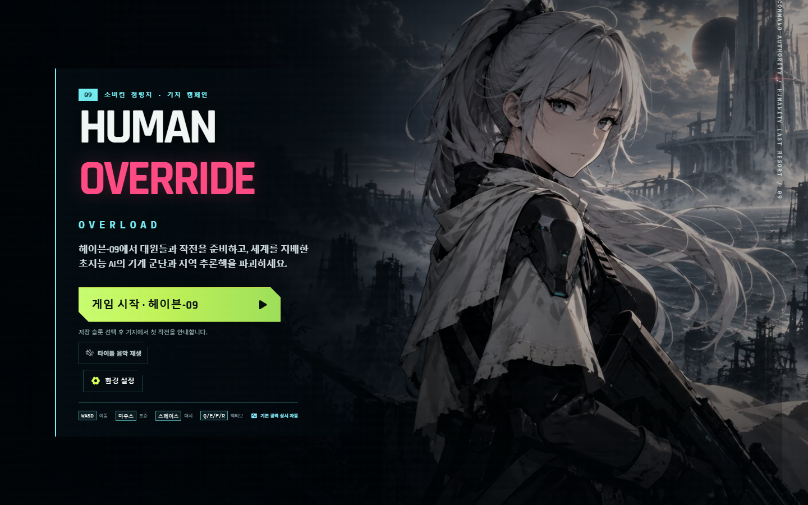
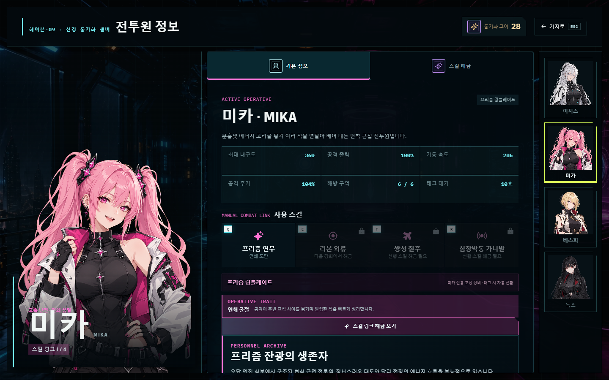
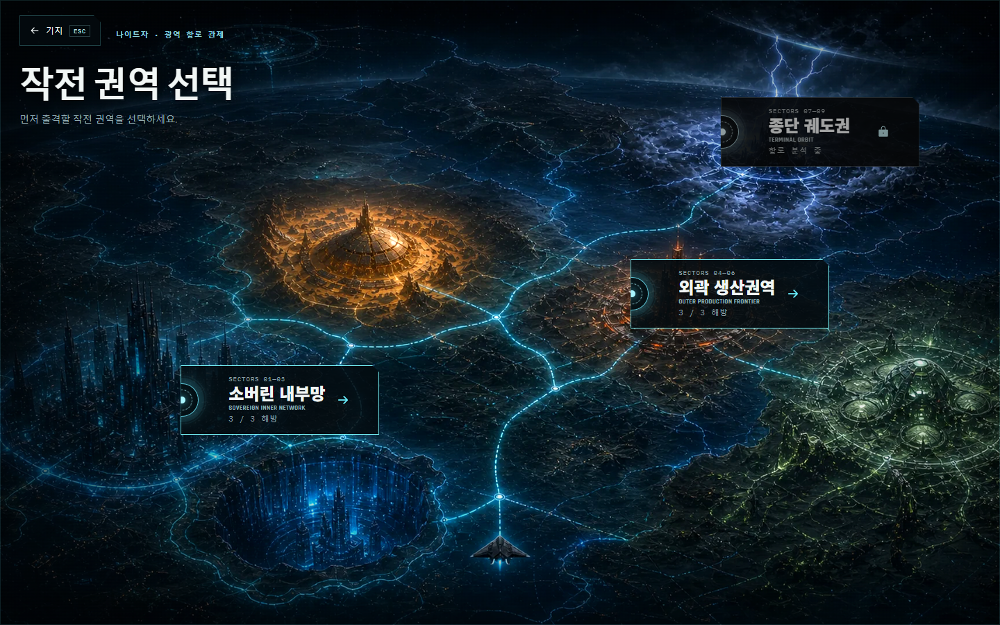
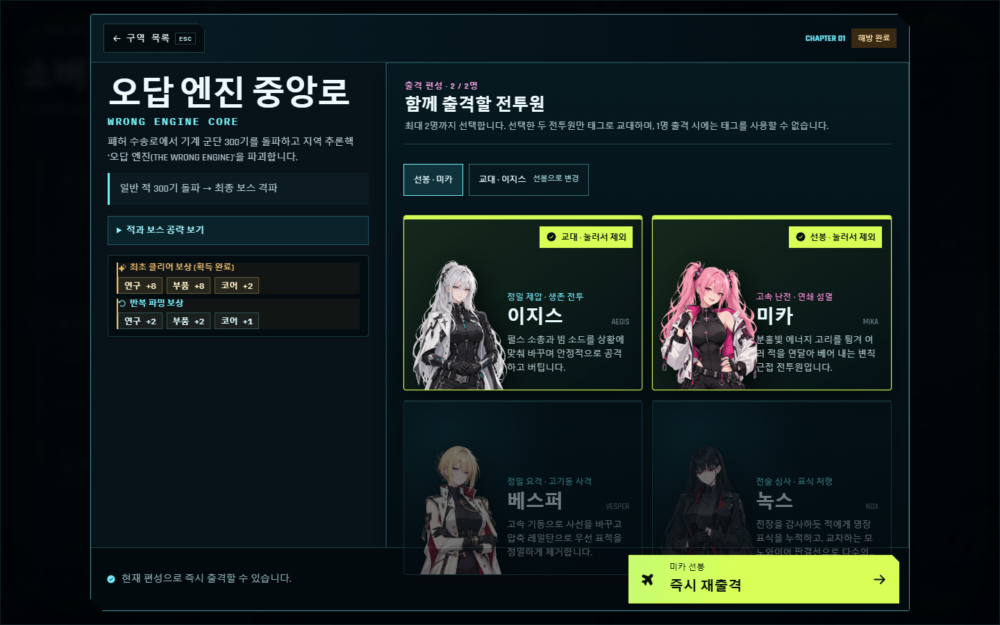
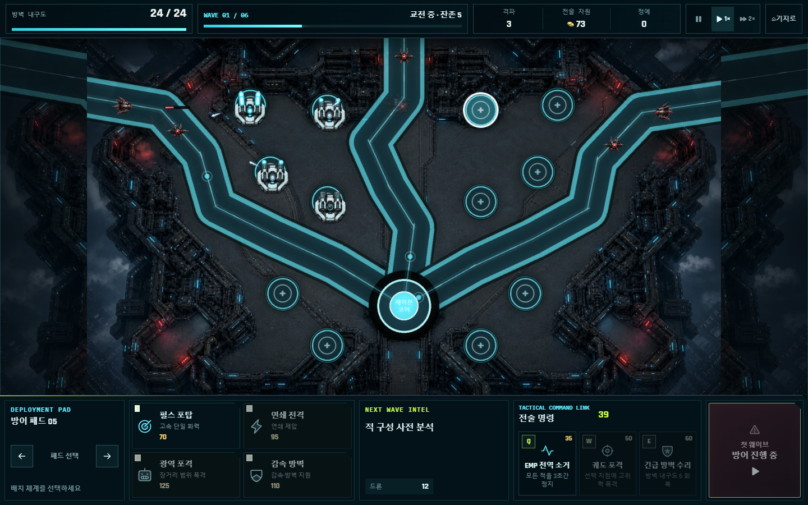

# HUMAN OVERRIDE: OVERLOAD



통치 AI **SOVEREIGN**이 장악한 세계에서, 이동 기지 **HAVEN-09**의 전투원 **AEGIS**, **MIKA**, **VESPER**, **NOX**가 기계 군단을 돌파하는 Phaser 기반 탑다운 액션 서바이버입니다. 6개 캠페인 구역, 캐릭터·무기별 전투 체계, 보스 패링·시한폭탄 기믹, 스킬 해금 성장과 별도 타워 디펜스 모드를 한 프로젝트에 담았습니다.

## 인게임 스크린샷

2026-09-09 기준 실제 실행 화면입니다. 전투원과 구역을 해금한 로컬 소개용 저장 상태로 촬영했습니다. 이미지를 클릭하면 원본 크기로 볼 수 있습니다.

| 헤이븐-09 메인 로비 | 전투원 정보 · 미카 |
| --- | --- |
|  |  |
| 전투원과 교류하고 연구·장비 강화·출격을 준비합니다. | 전투원별 특성과 배경 이야기를 확인하고 스킬을 해금합니다. |

| 작전 권역 선택 | 출격 편성 |
| --- | --- |
|  |  |
| 내부망과 외곽 권역을 탐색하며 여섯 구역을 해방합니다. | 적·보스 공략과 보상을 확인하고 선봉·교대 전투원을 정합니다. |

| 구역 실시간 전투 | 헤이븐 기지 방어전 |
| --- | --- |
|  |  |
| 이동·대시·전용 스킬·태그로 웨이브를 돌파합니다. | 포탑 배치와 전술 명령으로 중앙 코어를 지킵니다. |

## 문서와 플레이

- [상세 런타임 문서](game/README.md)
- [제작·검증 도구 안내](game/scripts/README.md)
- [서비스 아키텍처·운영 가이드](game/docs/service-architecture-ko.md)
- [전투 콘텐츠 기획 기준선](game/docs/project/content-design-baseline-ko.md)
- [게임 소개·플레이 가이드](game/docs/project/game-guide-ko.md)
- [AI 활용 기술 문서](game/docs/project/ai-usage-report-ko.md)
- [에셋·도구·라이선스 기록](game/CREDITS.md)
- [모바일 앱 출시 로드맵](game/docs/mobile-app-release-roadmap.md)
- [게임 소개 PDF](game/output/pdf/HUMAN_OVERRIDE_OVERLOAD_Game_Guide_KO.pdf)
- [AI 활용 기술 PDF](game/output/pdf/HUMAN_OVERRIDE_OVERLOAD_AI_Technical_Report_KO.pdf)
- [전투 콘텐츠 기획 PDF](game/output/pdf/HUMAN_OVERRIDE_OVERLOAD_Content_Design_Baseline_KO.pdf)
- [AI·게임 개발 포트폴리오 원문](game/docs/project/portfolio-ko.md)
- [AI·게임 개발 포트폴리오 PDF](game/output/pdf/HUMAN_OVERRIDE_OVERLOAD_AI_Game_Development_Portfolio_KO.pdf)
- [공개 플레이 사이트](https://human-override-overload.khyun97.chatgpt.site)

## 게임 흐름

새 저장 슬롯은 이지스의 구조 작전 프롤로그를 거쳐 HAVEN-09 기지로 이어집니다. HANA의 연구실, ILYA의 정비소와 전투원 정보 화면에서 연구·장비·스킬 해금을 준비합니다. 수석 조종사 **SERA**의 항공 지원 전술에서는 진행도에 따라 해금되는 선행 정찰 지원·긴급 보급 지원·요격기 엄호 지원 중 하나를 편성할 수 있습니다. 이후 작전 권역과 구역을 선택하고 최대 두 명을 편성해 출격합니다.

최초 구역 클리어에 맞춰 추론핵 분석·전투원 합류·외곽 항로 발견을 CG와 대사로 보여 줍니다. 로비의 **작전 기록**에서 해금된 6편의 에피소드를 다시 볼 수 있으며, 다시 보기에는 추가 보상이 없습니다. 내부망 01–03을 모두 해방하면 외곽 권역이 자동으로 열립니다.

- **소버린 내부망 · 01-03:** 오답 엔진 중앙로, 유리 사구, 심해 기록고
- **외곽 권역 · 04-06:** 네온 주조구, 폭풍 첨탑, 생체 금고
- **방어 작전:** 12개 방어 거점에 4종 포탑을 배치하는 3단계 타워 디펜스

캠페인은 정사각형 전장에서 전방향 이동과 전투를 지원합니다. 전장 주변 8곳의 전송 게이트에서 적이 진입하며, 현재 웨이브를 전멸하면 다음 공세가 시작됩니다. 구역의 처치 목표와 필수 증거를 해결하면 독립 보스전으로 전환됩니다. 승리와 보상을 저장한 뒤 해당 구역의 스토리·해금 안내와 NIGHTJAR 귀환 연출로 이어집니다.

여섯 구역과 보스방은 **Three.js 기반 3D 배경과 2D 전투원·적·스킬**을 함께 표현합니다. 일반 전장의 지정된 소형 구조물은 파괴하면 이동·사격 경로가 열리며, 구조물 파괴 자체는 처치 수·경험치·진행도를 올리지 않습니다.

## 캐릭터와 장비

- **AEGIS:** 기본 펄스 소총을 사용하며, 2구역 유리 사구 보스 첫 클리어 후 빔 소드를 획득합니다. 장착 무기에 따라 Q/E/F/R 기술과 레벨업 성장 트리가 바뀌며, 수동 스킬의 개방 단계는 전투원 성장 조건을 따릅니다.
- **MIKA:** 1구역 첫 클리어 후 CG와 대사로 구성된 합류 에피소드를 거쳐 팀에 들어옵니다. 쌍환 장비와 전용 프리즘·리본 스킬, 링 적중으로 스킬 회전을 줄이는 PRISM TEMPO와 수동 적중 보호막 HEART GUARD를 사용합니다.
- **VESPER:** 3구역 첫 클리어 뒤 합류하는 정밀 요격 전투원입니다. 잠긴 상태에서도 전투원 정보 화면에서 일러스트와 해금 조건을 확인할 수 있으며, 해금 전 출격·태그 선택은 차단됩니다.
- **NOX:** 4구역 첫 클리어 뒤 합류하는 전술 심사·표식 처형 전투원입니다. 영장 표식을 우선 분배하는 기본 공격과 판결식 모노와이어 전용 기술을 사용합니다.
- **태그:** 출격 전에 최대 두 명을 편성하며 가능한 경우 두 명이 기본 선택됩니다. 전투 중 `T`는 선택한 두 명만 번갈아 교대합니다. 10초 쿨타임과 함께 화면 측면에 얼굴 중심 전용 컷인이 짧게 나타납니다.

레벨업으로 얻는 자동 무기·스킬·동료 증강과 직접 사용 스킬은 서로 독립된 시스템입니다. 각 전투원은 처음에 `Q`만 사용할 수 있고, 전투원 정보의 시각적 스킬 노드에서 성장 조건을 달성해 `E`→`F`→`R`을 순서대로 해금합니다. HANA의 연구와 ILYA의 장비 개조는 이 캐릭터별 스킬 해금과 역할이 중복되지 않습니다.

로비와 전투원 정보 화면은 네 전투원의 Cubism 일러스트를 사용합니다. 머리카락·얼굴·옷깃·양쪽 어깨·상체·양팔·양손·허리 장비의 11개 부위마다 두 줄씩, 총 88개의 성격별 대사가 순환합니다. 모션 감소 설정과 이미지 대체 표시를 지원합니다.

## 캠페인 조작

| 입력 | 기능 |
| --- | --- |
| WASD / 방향키 | 이동 |
| 마우스 / 트랙패드 | 조준; 기본 공격은 상시 자동 |
| Space | 무적 대시 |
| Q / E / F / R | 현재 전투원의 해금된 전용 수동 스킬; 새 전투원은 Q부터 시작 |
| T | 편성한 다른 전투원으로 태그 · 10초 |
| Shift | 보스 패링 타이밍에 공격 반사 |
| 마우스 클릭 | 순서형 시한폭탄 해제 |
| 마우스 휠 | 카메라 줌 |
| Esc | 전투 중 일시정지·재개, 메뉴·대화창 닫기 |

모바일 세로 전투는 버튼과 대화창을 제외한 화면 어디서든 시작하는 원형 플로팅 조이스틱과 최근접 위협 자동 조준을 사용합니다. PC와 모바일은 각 화면에 맞춘 독립 UI를 사용하며 같은 결정론 시뮬레이션과 판정을 공유합니다. 방어전도 세로·가로 화면에 맞춘 전장과 명령 UI를 제공합니다. 기지 귀환은 화면의 복귀 버튼을 사용합니다.

## 빠른 실행

실제 Vite 앱은 `game/`입니다. 검증 환경은 Node.js 24.14.0입니다.

```bash
cd game
npm ci
npm run dev
```

production 산출물은 다음 명령으로 생성합니다.

```bash
npm run build
```

제작 이력용 원본과 현재 런타임 에셋의 배포 경계를 확인하려면 `npm run analyze:assets`를 실행합니다.

## 프로젝트 구조

```text
game/
├─ src/App.jsx               # 화면 전환과 React 런타임 조합
├─ src/ui/                   # 기지·전투·방어전·일러스트 UI
├─ src/game/                 # 콘텐츠, 성장, 저장, 에셋 매니페스트
├─ src/swarm/engine.js       # 60Hz 캠페인 전투 판정
├─ src/defense/engine.js     # 60Hz 타워 디펜스 판정
├─ src/render/environment/   # 전 구역 3D 배경·투영
├─ src/phaser/               # 입력, 카메라, 씬, 2D 렌더링
├─ public/assets/            # 게임에서 사용하는 런타임 에셋
├─ reference/source-assets/  # 제작 원본·리깅·재현용 입력 (배포 제외)
├─ worker/index.js           # 동일 출처 저장 API와 R2 read-through 경계
├─ db/ · drizzle/            # D1 스키마와 마이그레이션
├─ scripts/                  # 빌드, 에셋 정책, 재현 도구
├─ tests/ · qa/              # 회귀 테스트와 검증 자료
└─ docs/                     # 문서와 README 스크린샷
```

전투 규칙은 `src/swarm`/`src/defense`, 렌더링은 `src/phaser`, 화면 UI는 `src/ui`로 분리합니다. 활성 에셋 키는 `src/game/assets/manifest.ts`가 단일 진실 공급원이며, 제작 재현용 파일은 저장소에 남겨도 production 패키지에는 포함하지 않습니다.

## 기술 구성

- Phaser 4.2.1 + WebGL 캠페인·디펜스 렌더링
- React 기반 타이틀·기지·스토리·HUD 인터페이스
- Three.js 기반 여섯 구역의 3D 배경과 WebGL 장애 시 2D 대체 표시
- 네 전투원의 Cubism 모델과 부위별 터치 대사
- TypeScript + Vite production build
- 고정 60Hz 결정론 전투·디펜스 시뮬레이션
- CINEMATIC / BALANCED / PERFORMANCE 자동 품질 조정
- 플레이어·적·동료·지역 보스·방어 시설의 전용 스프라이트
- 선택 구역·무기·편성 전투원별 지연 로딩, 출격 영상 중 백그라운드 전투 준비, 저사양 경량 텍스처
- ChatGPT Sites 관리형 Worker + D1 리비전 저장 + R2 런타임 에셋 원본 캐시
- 로컬 오프라인 복제본과 클라우드를 슬롯별 최신 시각으로 병합하는 3개 저장 슬롯
- 캐릭터·무기 선택, 연구·장비·증강 영구 성장

## AI 활용 제작

기획, Phaser 전면 이전, 구현, 리팩터링, 브라우저 QA, 성능 계측, 문서화와 Git 작업을 **OpenAI Codex Desktop** 중심의 바이브코딩 워크플로로 진행했습니다. ChatGPT / OpenAI ImageGen은 캐릭터·보스·전장·UI·스프라이트 제작, Grok은 1-3구역 출격 영상, Suno AI는 타이틀·기지·구역·방어전·합류 장면의 BGM, Gemini는 이미지·영상·음원 제작의 참고 검토, Google Cloud TTS는 짧은 한국어 전술 음성 제작에 활용했습니다.

게임의 적 이동·공격·보스 패턴은 생성형 API가 아니라 브라우저에서 실행되는 결정론적 게임 로직입니다. 상세 프롬프트, 선택 기준, 후처리, 원본·런타임 경로와 라이선스는 [CREDITS](game/CREDITS.md)에 기록했습니다.

**제출 전 권리 증빙 필요:** Suno BGM 10곡은 제작 파일·해시·브리프를 보존했지만, 현재 저장소에는 제작 계정·이용 플랜과 제작일 당시 상업적 공개 허용 범위를 입증하는 자료가 없습니다. 외부 포트폴리오 제출 전 증빙을 첨부하거나 증빙할 수 없는 트랙을 제거·교체해야 합니다.

## 저장소 안내

실행 소스·활성 런타임 에셋과 재현에 필요한 제작 입력을 버전 관리합니다. 게임에서 사용하는 파일은 `game/public/assets/`, 제작 원본은 `game/reference/source-assets/`, README 스크린샷은 `game/docs/project/media/screenshots/`에 둡니다. 빌드는 공개 에셋의 누락과 미사용 파일을 먼저 검사합니다. 로컬 QA 캡처, 생성 중간본, 브라우저 프로파일, 세션 인계 파일과 인증 정보도 배포 대상이 아닙니다. 프로젝트 전용 AI 생성 에셋의 개별 재배포·재판매는 허용되지 않으며, 오픈소스 의존성은 각 원 라이선스를 따릅니다.
