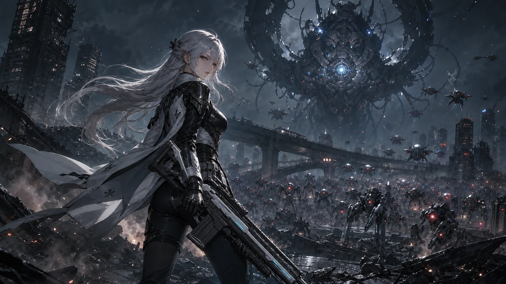

# HUMAN OVERRIDE: OVERLOAD



통치 AI **SOVEREIGN**이 장악한 세계에서, 이동 기지 **HAVEN-09**의 전투원 **AEGIS**, **MIKA**, **VESPER**, **NOX**가 기계 군단을 돌파하는 Phaser 기반 탑다운 액션 서바이버입니다. 6개 캠페인 구역, 캐릭터·무기별 전투 체계, 보스 패링·시한폭탄 기믹, 스킬 해금 성장과 별도 타워 디펜스 모드를 한 프로젝트에 담았습니다.

- [상세 런타임 문서](game/README.md)
- [서비스 아키텍처·운영 가이드](game/docs/service-architecture-ko.md)
- [전투 콘텐츠 기획 기준선](game/docs/project/content-design-baseline-ko.md)
- [게임 소개·플레이 가이드](game/docs/project/game-guide-ko.md)
- [AI 활용 기술 문서](game/docs/project/ai-usage-report-ko.md)
- [에셋·도구·라이선스 기록](game/CREDITS.md)
- [모바일 앱 출시 로드맵](game/docs/mobile-app-release-roadmap.md)
- [게임 소개 PDF](game/output/pdf/HUMAN_OVERRIDE_OVERLOAD_Game_Guide_KO.pdf)
- [AI 활용 기술 PDF](game/output/pdf/HUMAN_OVERRIDE_OVERLOAD_AI_Technical_Report_KO.pdf)
- [전투 콘텐츠 기획 PDF](game/output/pdf/HUMAN_OVERRIDE_OVERLOAD_Content_Design_Baseline_KO.pdf)
- [AI·게임 개발 포트폴리오 원문](game/docs/project/portfolio-ko.md)
- [AI·게임 개발 포트폴리오 PDF](game/output/pdf/HUMAN_OVERRIDE_OVERLOAD_AI_Game_Development_Portfolio_KO.pdf)
- [공개 플레이 사이트](https://human-override-overload.khyun97.chatgpt.site)

## 게임 흐름

게임은 전투가 아니라 HAVEN-09에서 시작합니다. HANA의 연구실, ILYA의 정비소와 전투원 정보 화면에서 연구·장비·스킬 해금을 준비하고, 수석 조종사 **SERA**의 항공 지원 전술에서 선행 정찰·긴급 보급·요격기 엄호 중 하나를 편성한 뒤 작전 권역과 구역을 선택해 전장에 진입합니다. 로비에는 음량·화면·조작·접근성 설정이 포함됩니다.

- **소버린 내부망 · 01-03:** 오답 엔진 중앙로, 유리 사구, 심해 기록고
- **외곽 권역 · 04-06:** 네온 주조구, 폭풍 첨탑, 생체 금고
- **방어 작전:** 12개 방어 거점에 4종 포탑을 배치하는 3단계 타워 디펜스

캠페인은 지역 테마별 **4,096×4,096 정사각형 전장**에서 360도 전방향 이동과 전투를 지원합니다. 근접형 8기로 시작한 뒤 현재 웨이브를 전멸하면 플레이어 위치와 관계없이 다음 공세를 경고·배치합니다. 14→22→34→52→79→120→180→220기 웨이브와 지역별 총 적 예산은 결정론적으로 관리되며, 모든 적은 8방향 전송 게이트를 통해 시각적으로 출현합니다. 첫 지역의 ROOK·NYX·MOSS 흔적은 실제 이미지와 상호작용 좌표가 일치하며, 지역 적 예산과 필수 증거를 모두 해결하면 독립 보스전으로 자동 전환됩니다. 승리는 즉시 저장되고 결과·보상·해금 장면 뒤 NIGHTJAR 귀환 연출로 이어집니다.

## 캐릭터와 장비

- **AEGIS:** 기본 펄스 소총을 사용하며, 2구역 유리 사구 보스 첫 클리어 후 빔 소드와 전용 짧은 주기 Q/E/F/R 검술을 해금합니다. 무기에 따라 수동 스킬과 레벨업 성장 트리가 바뀝니다.
- **MIKA:** 1구역 첫 클리어 직후 중앙 캐릭터 일러스트와 하단 대화창으로 구성된 합류 장면을 거쳐 팀에 들어옵니다. 쌍환 장비와 전용 프리즘·리본 스킬, 링 적중으로 스킬 회전을 줄이는 PRISM TEMPO와 수동 적중 보호막 HEART GUARD를 사용합니다.
- **VESPER:** 3구역 첫 클리어 뒤 합류하는 정밀 요격 전투원입니다. 잠긴 상태에서도 전투원 정보 화면에서 일러스트와 해금 조건을 확인할 수 있으며, 해금 전 출격·태그 선택은 차단됩니다.
- **NOX:** 4구역 네온 주조장 첫 클리어 뒤 합류하는 전술 심사·표식 처형 전투원입니다. 영장 표식을 우선 분배하는 기본 공격과 판결식 모노와이어 전용 기술을 사용합니다.
- **태그:** 둘 이상의 전투원이 해금되면 전투 중 `T`로 다음 전투원과 교대합니다. 10초 쿨타임과 함께 화면 측면에 얼굴 중심 전용 컷인이 짧게 나타납니다.

레벨업으로 얻는 자동 무기·스킬·동료 증강과 직접 사용 스킬은 서로 독립된 시스템입니다. 각 전투원은 처음에 `Q`만 사용할 수 있고, 전투원 정보의 시각적 스킬 노드에서 성장 조건을 달성해 `E`→`F`→`R`을 순서대로 해금합니다. HANA의 연구와 ILYA의 장비 개조는 이 캐릭터별 스킬 해금과 역할이 중복되지 않습니다.

## 조작

| 입력 | 기능 |
| --- | --- |
| WASD / 방향키 | 이동 |
| 마우스 / 트랙패드 | 조준; 기본 공격은 상시 자동 |
| Space | 무적 대시 |
| Q / E / F / R | 현재 전투원의 해금된 전용 수동 스킬; 새 전투원은 Q부터 시작 |
| T | 해금된 다음 전투원으로 태그 · 10초 |
| Shift | 보스 패링 타이밍에 공격 반사 |
| 마우스 클릭 | 순서형 시한폭탄 해제 |
| 마우스 휠 | 카메라 줌 |
| Esc | 일시정지·창 닫기·기지 귀환 |

모바일 세로 전투는 버튼과 대화창을 제외한 화면 어디서든 시작하는 원형 플로팅 조이스틱과 최근접 위협 자동 조준을 사용합니다. PC와 모바일은 각 화면에 맞춘 독립 UI를 사용하며 같은 결정론 시뮬레이션과 판정을 공유합니다. 디펜스 모드도 720×1,280 세로 전장을 별도로 제공합니다.

## 빠른 실행

실제 Vite 앱은 `game/`입니다. Node.js 20 이상을 권장합니다.

```bash
cd game
npm ci
npm run dev
```

production 산출물은 다음 명령으로 생성합니다.

```bash
npm run build
```

제작 이력용 원본과 현재 런타임 에셋의 배포 경계를 확인하려면 `npm run analyze:assets`를 실행합니다.

## 프로젝트 구조

```text
game/
├─ src/App.jsx                 # 화면 전환과 React 런타임 조합
├─ src/ui/                    # campaign / combat / defense UI 책임
├─ src/game/                  # 콘텐츠, 성장, 저장, 에셋 매니페스트
├─ src/swarm/engine.js        # 60Hz 캠페인 전투 판정
├─ src/defense/engine.js      # 60Hz 타워 디펜스 판정
├─ src/phaser/                # 씬, 뷰, React 어댑터
├─ public/assets/             # 활성 런타임 에셋과 재현용 제작 입력
├─ worker/index.js            # 동일 출처 저장 API와 R2 read-through 경계
├─ db/ · drizzle/             # D1 스키마와 마이그레이션
├─ scripts/                   # 빌드, 에셋 정책, 재현 도구
├─ tests/ · qa/               # 회귀 테스트와 성능·시각 검증 기록
└─ docs/                      # 서비스·기획·AI 활용 문서
```

전투 규칙은 `src/swarm`/`src/defense`, 렌더링은 `src/phaser`, 화면 UI는 `src/ui`로 분리합니다. 활성 에셋 키는 `src/game/assets/manifest.ts`가 단일 진실 공급원이며, 제작 재현용 파일은 저장소에 남겨도 production 패키지에는 포함하지 않습니다.

## 기술 구성

- Phaser 4.2.1 + WebGL 캠페인·디펜스 렌더링
- React 기반 타이틀·기지·캠페인·HUD 인터페이스
- TypeScript + Vite production build
- 고정 60Hz 결정론 전투·디펜스 시뮬레이션
- CINEMATIC / BALANCED / PERFORMANCE 자동 품질 조정
- 플레이어·적·동료·지역 보스·방어 시설의 전용 스프라이트
- 선택 구역·무기·해금 전투원별 지연 로딩, 출격 영상 중 백그라운드 전투 준비, 저사양 경량 텍스처
- ChatGPT Sites 관리형 Worker + D1 리비전 저장 + R2 런타임 에셋 원본 캐시
- 로컬 오프라인 복제본과 클라우드를 슬롯별 최신 시각으로 병합하는 3개 저장 슬롯
- 캐릭터·무기 선택, 연구·장비·증강 영구 성장

## AI 활용 제작

기획, Phaser 전면 이전, 구현, 리팩터링, 브라우저 QA, 성능 계측, 문서화와 Git 작업을 **OpenAI Codex Desktop** 중심의 바이브코딩 워크플로로 진행했습니다. ChatGPT / OpenAI ImageGen은 캐릭터·보스·전장·UI·스프라이트 제작, Grok은 1-3구역 출격 영상, Suno AI는 타이틀·기지·1-3구역 BGM, Gemini는 이미지·영상·음원 제작의 참고 검토, Google Cloud TTS는 짧은 한국어 전술 음성 제작에 활용했습니다.

게임의 적 이동·공격·보스 패턴은 생성형 API가 아니라 브라우저에서 실행되는 결정론적 게임 로직입니다. 상세 프롬프트, 선택 기준, 후처리, 원본·런타임 경로와 라이선스는 [CREDITS](game/CREDITS.md)에 기록했습니다.

**제출 전 권리 증빙 필요:** Suno BGM 10곡은 제작 파일·해시·브리프를 보존했지만, 현재 저장소에는 제작 계정·이용 플랜과 제작일 당시 상업적 공개 허용 범위를 입증하는 자료가 없습니다. 외부 포트폴리오 제출 전 증빙을 첨부하거나 증빙할 수 없는 트랙을 제거·교체해야 합니다.

## 저장소 안내

현재 GitHub 원격 저장소는 소유자가 직접 **Private**로 운영합니다. 실행 소스·활성 런타임 에셋과 재현에 필요한 제작 계약을 버전 관리하며, 제작 이력 전용 에셋 46개(현재 21.41 MiB)는 production 패키징 단계에서 제외합니다. 로컬 QA 캡처, 생성 중간본, 브라우저 프로파일, 세션 인계 파일과 인증 정보도 배포 대상이 아닙니다. 프로젝트 전용 AI 생성 에셋의 개별 재배포·재판매는 허용되지 않으며, 오픈소스 의존성은 각 원 라이선스를 따릅니다.

## 전투 그래픽 개선 — 2026-09-06

캐릭터 스킬 화풍, 적·보스의 발 방향, 외곽 동작 시트, 방어전의 방향별 이동을 개선했습니다. [적용 내용과 검수 범위](game/docs/art/sprite-quality-implementation-2026-09-06.md)를 확인할 수 있습니다. 현재는 로컬 변경 기준입니다.

- 2026-09-06 로컬 NPC UI 개선: 공통 인체 비율, 대화창 하단 연결, 시설·항공 지원 인물 확대. 상세 검수는 `game/design-qa.md` 참고.

## 출격 편성과 작전 안내 개선 - 2026-09-06

현재 구역 출격은 해금된 전투원 중 1-2명을 선택한다. 첫 번째는 선봉, 두 번째는 교대 전투원이며 화면에서 선봉을 바꿀 수 있다. 두 명 선택 시 다른 전투원을 추가하려면 기존 선택을 해제한다. 태그는 선택한 두 명 사이에서만 번갈아 작동하고, 1명 출격 시 사용할 수 없다. 선택한 편성은 능력 안내, 출격 영상, 전투 진입과 결과 화면의 재출격까지 유지된다. 기존 태그 재사용 대기시간과 전투원별 능력 상태는 유지한다. 과거의 해금 전투원 전체 순환 설명은 이 규칙으로 대체한다.

작전 상세는 ‘적과 보스 공략 보기’로 개선했다. 일반 적 처치 목표와 중간 보스 유무, 최종 보스 이미지를 보여주며, 6개 구역의 적 구성과 위험한 공격, 대응 요령을 실제 전투 패턴에 맞는 한국어로 안내한다. 첫 클리어와 반복 보상은 유지한다. 보스 미리보기는 기존 애니메이션 시트의 첫 프레임만 표시한다.

전투원 일러스트는 클릭·대기·포인터 추적에서 머리만 따로 이동하거나 회전하지 않는다. 머리 클릭 대사와 표정 반응, 호흡, 머리카락 및 다른 부위의 반응은 유지한다. 이 변경은 기존 일러스트 연출의 조정이며 새로운 Cubism 리깅 완성을 의미하지 않는다.

검증: 관련 테스트 157개와 TypeScript 검사 통과. 브라우저에서 두 명 제한, 제외·교체·선봉 변경, 출격 인자와 데스크톱·모바일 배치를 확인했고, 실제 Phaser 전투에서 녹스·미카의 반복 태그 및 텍스처 로딩을 확인했다. 이 항목은 로컬 변경 기준이며 신규 배포를 뜻하지 않는다.

## 1구역 실시간 3D 전장 - 2026-09-06

오답 엔진 중앙로의 수송로와 보스방을 Three.js 0.185.1 기반 실시간 3D 환경으로 적용했다. 수송 레일, 철판 바닥, 매립 케이블·배수 격자, 냉각 탱크, 회전 터빈, 전력 중계기, 외곽 배기·변압 설비를 코드로 모델링했다. 별도 GLB나 외부 모델을 가져온 작업은 아니다. 기존 전투원·적·보스·스킬은 2D 표현을 유지한다. 고정된 직교 카메라의 지면 투영은 기존 전투 좌표와 일치하며, 이동·조준·태그 규칙은 결정론적 엔진이 관리한다. 이후 2-6구역 확장과 구조물 파괴가 추가되었으며 현재 규칙은 다음 절에 정리한다.

수송로의 독립 구조물 10개는 공통 원형 충돌 범위를 사용한다. 전투원은 구조물을 돌아 이동하며, 적도 우회한다. 빠른 이동과 양측 일반 탄환은 선분 충돌로 관통을 막는다. 광역·공중 스킬은 기존 영역 공격 규칙을 유지한다. 구조물 내부에 생성된 적·회복 키트·경험치 아이템은 바깥으로 보정한다. 구조물이 인물을 가리는 위치에서는 반투명하게 표시한다. 보스방 중앙은 기존 패턴의 회피 공간을 확보하기 위해 장애물 없이 유지한다. 미니맵과 출격 전 공략도 새 지형과 일치하도록 갱신했다.

최초 1구역 구현은 Three.js를 지연 로딩하고, Phaser가 확정한 카메라와 프레임에 맞춰 별도 WebGL 2 배경 캔버스를 그린다. 별도의 애니메이션 루프나 3D 물리 세계를 만들지 않는다. 고정 조명, 병합한 정적 메시, 접지 그림자와 품질별 렌더 해상도로 부하를 제한한다. 3D 초기화 실패 또는 컨텍스트 손실 시 기존 2D 배경과 같은 위치의 장애물 표시로 대체한다. 복구·리사이즈·종료 시 자원 정리를 검증했다.

검증: 지형·태그·전투·Phaser 관련 집중 테스트 129개 및 TypeScript 검사 통과. 브라우저에서 실제 로비 출격, 태그, 가림 처리, 390x844 세로 화면과 844x390 리사이즈, 보스방, 그래픽 컨텍스트 손실·복구, 종료 후 2구역 재진입을 확인했다. 실제 카메라의 지면 정렬 오차는 검수점에서 0.001px 미만이었다. 검수 프레임의 3D 추가 드로콜은 수송로 33-89회, 보스방 10회였다. 수치는 해당 화면의 브라우저 측정이며 실물 모바일 기기의 프레임 성능 보증이 아니다. 전체 프로덕션 빌드와 배포는 이번 작업에 포함하지 않았다.

## 전 구역 3D 전장과 구조물 파괴 - 2026-09-06

1구역에 이어 2-6구역의 일반 전장과 보스방에도 실시간 3D 환경을 적용했다. 전투원·적·보스·스킬은 기존 2D 표현을 사용한다. 지형은 Three.js 메시와 절차적 재질로 제작했다.

- 2구역 유리 사구: 모래 바닥, 수정 군집, 반사경 기둥과 외곽 사구.
- 3구역 심연 기록고: 매립 데이터 통로, 서버 설비, 기록 기둥과 침수된 외곽 설비.
- 4구역 네온 주조구: 격자로 덮인 용융 통로, 소형 용광로, 대형 프레스와 배기 설비.
- 5구역 폭풍 첨탑: 고가 갑판, 축전기, 코일 기둥과 회전하는 외곽 풍력 설비.
- 6구역 생체 금고: 육각 격실 바닥, 배양조, 생체 기둥과 외곽 격리 설비.

각 일반 전장은 서로 다른 배치의 구조물 10개를 갖는다. 냉각 탱크·수정 군집·낮은 서버·소형 용광로·축전기·배양조는 양측 일반 탄환과 검 공격으로 파괴할 수 있다. 피격 시 내구도 표시가 나타나고, 파괴되면 붕괴와 파편 연출 뒤 낮은 잔해가 남는다. 잔해는 이동과 사격을 막지 않는다. 대형 기둥과 프레스는 파괴되지 않으며, 보스방 내부는 회피 공간을 위해 비워 둔다. 다른 광역·공중 능력은 기존 공격 규칙을 따른다.

구조물 상태는 결정론적 전투 엔진이 관리하며, 파괴 즉시 충돌 목록·2D 대체 표시·미니맵에서 제거한다. 구조물 파괴는 적 처치 수, 경험치, 권역 진행도를 올리지 않는다. 새 출격에서는 설비 내구도가 복구된다. 작전 공략에도 파괴 가능한 설비와 우회할 구조물을 한국어로 설명한다. WebGL 2 장애 시 기존 배경과 같은 위치의 2D 충돌 표시로 전환한다.

검증: 관련 집중 테스트 168개와 TypeScript 검사 통과. 2-6구역 각각의 일반 전장·보스방, 실제 탄환에 의한 파괴, 지면 좌표 정렬, 그래픽 컨텍스트 손실·복구와 종료 후 캔버스 정리를 브라우저에서 확인했다. 6구역은 실제 앱의 출격·HUD·미니맵과 390x844 / 844x390 모바일 표시를 추가 확인했다. 지면 정렬 오차는 검수점에서 0.001px 미만이었다. 전체 캠페인 완주, 실물 모바일 성능 측정, 전체 프로덕션 빌드 및 신규 배포는 이 변경의 검증 범위에 포함하지 않았다. 로컬 서버에서 테스트할 수 있다.


## 출격 준비 및 방어전 UI 보정 - 2026-09-06

출격 준비에 들어오면 현재 전투원을 선봉으로 유지하고 해금된 다른 전투원 한 명을 예비로 자동 선택한다. 해금된 전투원이 한 명이면 단독 편성이며, 사용자가 예비를 제외하면 그 선택을 유지한다. 태그는 선택된 최대 두 명 사이에서만 가능하다.

여섯 구역의 3D 전장과 보스방에서 중앙 바닥 문구를 제거했다. 1-3구역 자폭 드론 원본은 붉은 전면부가 오른쪽을 향하므로 불필요한 90도 회전 보정을 제거했다. 보행형 적과 보스의 발 아래 방향 규칙, 외곽 비행체의 원본 방향 보정은 유지한다.

권역 지도와 구역 선택 제목은 좌측 상단에 배치하고 뒤로가기 버튼과 설명 사이에 간격을 확보했다. 전투원 상호작용 말풍선은 얼굴 아래로 내리고 캐릭터 영역 안쪽에 고정했다.

방어전은 상단 상태, 전장, 하단 명령을 분리한다. 넓은 화면은 다섯 명령 구역을 쓰며, 1300px 이하 또는 낮은 가로 화면에서는 포탑 건설/포대 관리/전술 명령 탭을 사용한다. 안내창은 1열 본문과 실제 대상 크기를 측정한 강조 테두리를 사용한다. 포탑 이름과 비용, 공격력/사거리/공격 간격, 강화/철거/전문화 정보를 읽을 수 있게 정리했다. ESC는 일시정지/재개이며 기지 복귀는 명시적인 버튼을 사용한다. 설치 후 다음 빈 패드 자동 선택은 유지한다.

검증: TypeScript와 관련 63개 테스트 통과. 실제 브라우저에서 1440x900, 390x844, 844x390 방어전 가이드 4단계, 설치/강화/전문화/판매/공세 시작/ESC 일시정지를 확인했다. 1920x900 및 390x844 구역 선택과 기본 두 명 출격, 네 캐릭터의 데스크톱/모바일 말풍선, 1-3구역 실제 전투의 3D 표시를 확인했다. 전체 캠페인 클리어와 실기기 성능 인증은 포함하지 않는다. 이번 변경은 로컬 수정이며 별도 배포하지 않았다.
