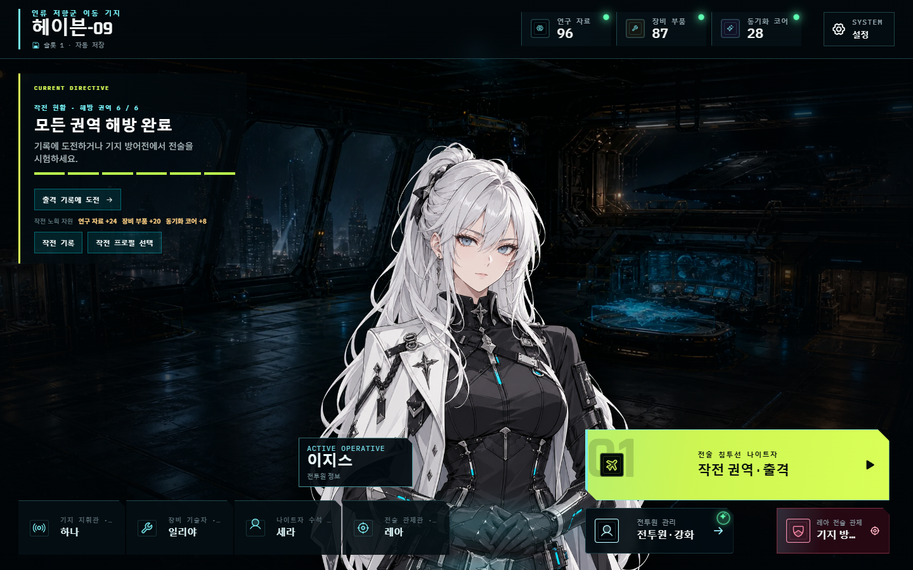
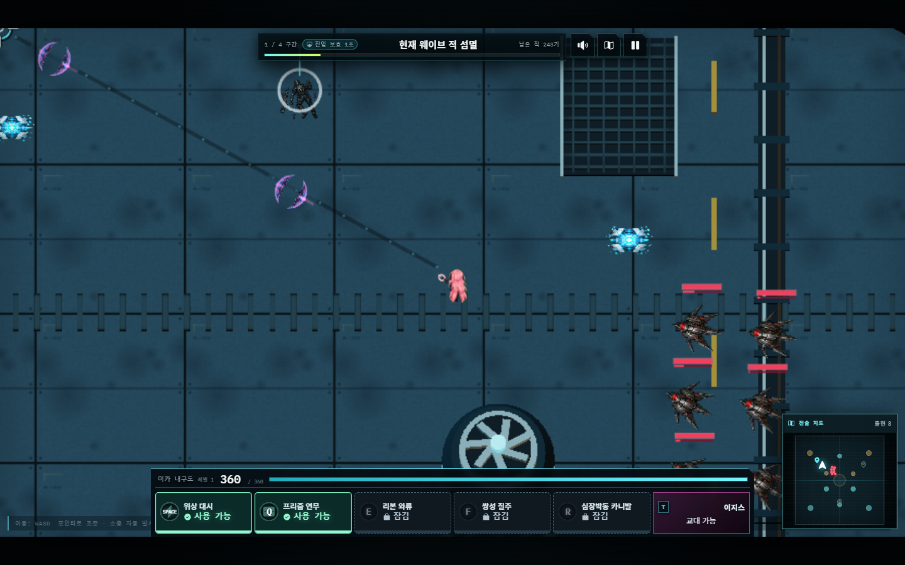

# HUMAN OVERRIDE: OVERLOAD

4명 전투원과 6개 구역의 실시간 3D 배경·2D 전투를 결합한 웹 액션 서바이버입니다. 이 문서는 현재 실행·제작·검증 경로를 안내합니다. 게임 소개와 전체 스크린샷은 [루트 README](../README.md)에서 확인할 수 있습니다.

## 인게임 미리보기

| 헤이븐-09 로비 | 실시간 구역 전투 |
| --- | --- |
|  |  |

[타이틀·전투원 정보·작전 지도·출격 편성·방어전까지 전체 스크린샷 보기](../README.md#인게임-스크린샷)

## 실행과 검사

검증 환경은 Node.js 24.14.0입니다. 저장소의 `game/`에서 실행합니다.

```bash
npm ci
npm run dev -- --port 4174
npm test
npm run build
```

- `npm run analyze:assets`: 모든 구역·전투원·방어전·화질 단계·화면·음원의 누락과 미사용 공개 파일을 검사합니다.
- `npm run analyze:content`: 현재 콘텐츠와 경제 수치를 산출합니다.
- `npm run test:sites`: 저장 API와 배포 Worker를 검사합니다.
- `npm run typecheck`: TypeScript 타입을 검사합니다.
- 빌드는 에셋 검사 → TypeScript → Vite → Sites 배포 디렉터리 준비 순서입니다. 산출물은 `dist/client`, `dist/server`, `dist/.openai`입니다.
- `scripts/production-asset-policy.mjs`가 에셋 소유권과 구형 공개 경로를 검사합니다.
- `public/`은 실제 게임에 필요한 파일만 포함합니다. 제작 도구와 원본, 검수 화면, PDF는 배포하지 않습니다.

## 플레이 규칙

- 새로운 슬롯은 이지스의 구조 작전 프롤로그로 시작합니다. 최초 구역 클리어 뒤 추론핵 분석·전투원 합류·외곽 항로 발견을 CG와 대사로 보여 줍니다. 헤이븐 **작전 기록**에서 해금된 6편을 다시 볼 수 있으며 보상은 중복 지급하지 않습니다.
- AEGIS는 기본 전투원입니다. MIKA는 01구역, VESPER는 03구역, NOX는 04구역 최초 클리어로 합류합니다.
- 출격은 최대 두 명입니다. 가능한 경우 현재 전투원과 다른 해금 전투원 한 명을 기본 선택하고, 단독 출격으로 바꿀 수 있습니다. 태그는 선택한 두 명만 번갈아 사용합니다.
- 각 전투원은 Q부터 시작하며 동기화 성장으로 E·F·R을 해금합니다. 스킬 상태와 재사용 대기시간은 엔진이 관리하고 교대 후에도 보존합니다.
- 내부망 01–03을 모두 해방하면 외곽 권역이 자동으로 열립니다. 브리핑 대화는 별도 잠금 조건이 아닙니다.
- 6개 구역과 보스방은 3D 배경을 공유하며 테마별 구조물이 다릅니다. 지정된 소형 구조물은 파괴 후 이동·사격 경로를 열고, 처치 수나 경험치는 주지 않습니다.
- 적은 전장 주변 8곳의 전송 게이트에서 진입합니다. 비행 지원은 SERA의 선행 정찰 지원·긴급 보급 지원·요격기 엄호 지원 중 하나를 선택합니다.
- 방어전은 세 작전과 네 종류 포탑을 사용하는 별도 결정론 엔진입니다. 캠페인 저장·재화·설정과 연결됩니다.
- 로비·전투원 정보는 네 전투원의 Cubism 모델을 사용합니다. 캐릭터별 11개 터치 부위에 두 줄씩 총 88개의 대사가 있으며, 부위별로 순환합니다.

## 코드 구조

| 위치 | 책임 |
| --- | --- |
| `src/App.jsx` | 화면 이동, 진행 흐름, 앱 수명의 음악·설정·컨트롤러 연결 |
| `src/ui/campaign/CampaignScreens.jsx` | 기지, 전투원, 권역 선택, 출격 화면 |
| `src/game/content/storyEpisodes.js`, `src/ui/campaign/StoryScreens.jsx` | CG 에피소드, 진행 조건, 작전 기록 다시 보기 |
| `src/ui/combat/ExpeditionCombatDock.jsx` | 전투 체력·스킬·태그 HUD |
| `src/ui/combat/cooldownPresentation.js` | 사용 가능·재충전·잠김 등 상태 표현 |
| `src/ui/defense/DefenseScreens.jsx` | 방어전 UI와 전술 안내 |
| `src/ui/combat/combatPresentation.js` | 전투 안내·대사·이벤트의 표현 |
| `src/ui/portrait/`, `src/ui/settings/` | 일러스트 카메라·상호작용, 설정 |
| `src/swarm/engine.js` | 캠페인 전투 판정·시간·상태 |
| `src/defense/engine.js` | 방어전 판정·웨이브·명령 |
| `src/game/content/` | 전투원·스킬·구역·지형·기지의 콘텐츠 규칙 |
| `src/game/save/`, `src/game/settings/` | 진행 저장·클라우드 복제·설정 |
| `src/game/assets/manifest.ts` | 런타임 에셋 등록과 상황별 로딩 |
| `src/phaser/` | 입력, 카메라, 씬 수명, 2D 렌더링 |
| `src/render/environment/` | 전 구역 Three.js 지형·투영·구조물 표현 |
| `src/audio/` | 음악 전환·재생 유지, 효과음, 음성 |
| `src/styles/` | 화면별 추가 스타일과 현재 HUD 규칙 |
| `worker/index.js`, `db/schema.ts`, `drizzle/`, `.openai/` | 저장 API, DB 스키마·마이그레이션, 배포 설정 |

React·Phaser·Three.js는 같은 시뮬레이션 상태를 표현합니다. 피해·충돌·스킬 시간은 렌더러로 옮기지 않으며, Three.js에 독립 실행 루프를 추가하지 않습니다. WebGL 장애 시 대체 지형과 기존 충돌 규칙을 유지합니다.

## 에셋과 제작 자료

게임에서 사용하는 에셋만 `public/assets/`에 둡니다. 전투 스프라이트는 `overload/quality-v3/`, 전투원·NPC의 정적 일러스트는 `overload/portraits/anime-v1/`, Cubism 런타임은 `overload/live2d/anime-v2/`, 스토리 CG는 `overload/story/awakening/`을 사용합니다. 실제 등록·로딩 경로는 `src/game/assets/manifest.ts`와 `src/game/content/storyEpisodes.js`를 따릅니다. 파일 수·용량·누락·미사용 여부는 `npm run analyze:assets`로 확인합니다.

- `reference/source-assets/overload/runtime-inputs/`: 원본 아틀라스, 이전 일러스트와 재현에 필요한 제작 계약을 보존합니다.
- `reference/source-assets/overload/sprite-quality-v3/`: 현행 그래픽을 다시 만드는 검수된 원본과 프레임 분리 자료입니다.
- `reference/source-assets/overload/live2d-production/anime-v2/`: 네 전투원의 편집 가능한 PSD·CMO3와 리깅 소재입니다. 런타임은 여기서 내보낸 MOC3와 전용 텍스처를 사용합니다. 머리 회전은 고정하며, 눈꺼풀·머리카락·팔·코트·몸통 모션을 사용합니다. 눈동자·눈썹·입술의 독립 표정 파라미터는 구현되지 않았습니다.
- `tools/`: 로컬 전투 스프라이트·일러스트·현재 Cubism 검수 화면입니다. 개발 서버의 `/tools/combat-sprite-review.html` 등에서 엽니다.
- `docs/project/media/`: 문서에 실제로 쓰는 영구 이미지입니다. 임시 QA 캡처 경로와 사용자 다운로드 폴더에 의존하지 않습니다.
- `output/pdf/`: 현재 제출·열람용 PDF입니다. 생성 중간본은 `tmp/pdfs/`에 둡니다.
- `qa/`, `tmp/`, `dist/`: 재생성 가능한 검증·작업·빌드 결과입니다. 현재 필요한 제작 원본과 혼용하지 않습니다.

제작 명령은 [도구 안내](scripts/README.md), 에셋 출처와 사용 조건은 [CREDITS](CREDITS.md)에서 확인합니다. 문서 이미지와 제작 원본은 게임 배포에 포함하지 않습니다.

## 검증

`npm test`로 콘텐츠·진행 저장·전투·UI 계약을 검사하고, `npm run build`로 에셋 정책·타입·배포 산출물을 확인합니다. README 설명과 코드 경로만 검사하려면 `node --test tests/readme-consistency.test.mjs`를 실행합니다.

브라우저 검수는 `npm run dev -- --port 4174`로 로컬 서버를 켠 뒤 실행합니다.

| 명령 | 확인 범위 |
| --- | --- |
| `node scripts/verify-skill-readiness.mjs` | 스킬 사용·재충전·일시정지·태그와 화면 크기별 HUD |
| `node scripts/verify-combat-sprites.mjs` | 전투 스프라이트와 렌더링 |
| `node scripts/verify-anime-cubism.mjs` | 네 전투원의 11개 터치 부위·대사, 화면 크기별 배치, 모션 감소·그래픽 자원 정리·대체 표시 |

브라우저 도구는 별도 테스트 프로필과 소개용 저장 상태를 사용합니다. Windows Edge와 Playwright가 필요하며 도구별 기본 경로가 다르므로 실행 환경에 맞춰 설정합니다. Cubism 검수기는 `PLAYWRIGHT_MODULE`, `EDGE_EXECUTABLE`, `QA_BASE_URL`, `QA_OUTPUT` 환경 변수를 지원합니다. 이 검수는 실물 모바일 기기의 성능 측정이나 전체 캠페인 완주 검증을 대신하지 않습니다.

## 문서

- [플레이 가이드](docs/project/game-guide-ko.md)
- [전투 콘텐츠 기획](docs/project/content-design-baseline-ko.md)
- [서비스 구조·저장·운영](docs/service-architecture-ko.md)
- [AI 활용과 검증 범위](docs/project/ai-usage-report-ko.md)
- [개발 포트폴리오](docs/project/portfolio-ko.md)
- [채용 제출용 PDF](output/pdf/human-override-overload-recruitment-portfolio.pdf)
- [에셋·라이선스·제작 이력](CREDITS.md)
- [음성 생성](GOOGLE_TTS_SETUP.md), [Suno BGM 프롬프트](SUNO_BGM_PROMPTS.md)
- [모바일 출시 로드맵](docs/mobile-app-release-roadmap.md)

[공개 플레이 사이트](https://human-override-overload.khyun97.chatgpt.site)
