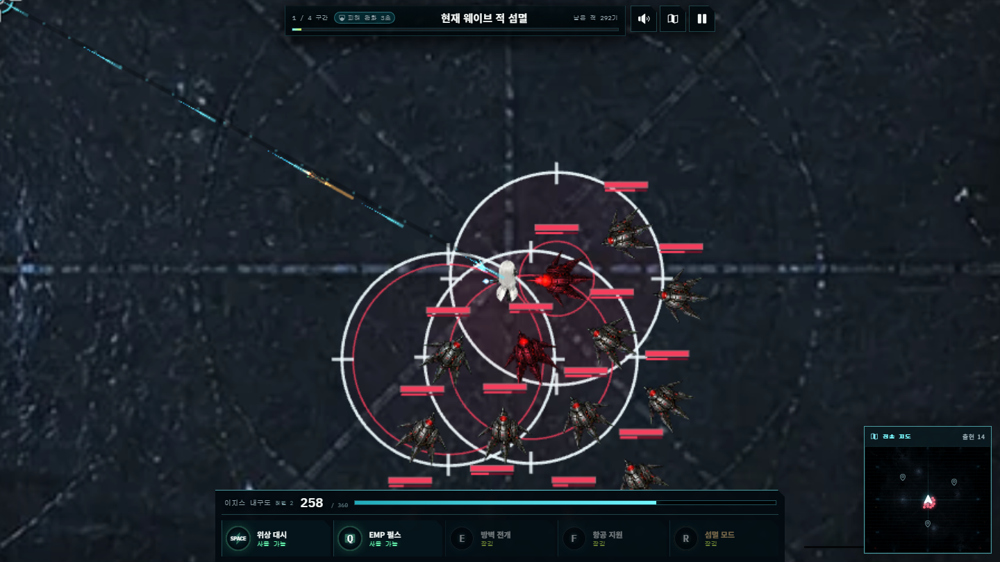
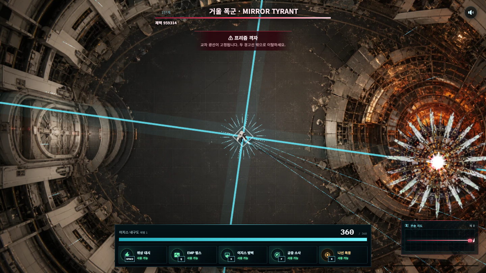

# HUMAN OVERRIDE: OVERLOAD

## AI 활용 기술 문서

**프로젝트 기술 문서**
개인 프로젝트 · GitHub `kwakhyun` · 2026년 8월

> 기획, 프로토타이핑, 엔진 이전, 게임 로직, 아트·영상·음악 제작, QA, 성능 측정, 문서화와 배포까지 전 과정을 인간의 디렉팅과 멀티 AI 도구의 반복 협업으로 완성한 바이브코딩 프로젝트입니다.

**공개 플레이:** [human-override-overload.khyun97.chatgpt.site](https://human-override-overload.khyun97.chatgpt.site)

**소스 관리:** [GitHub 저장소](https://github.com/kwakhyun/human-override-overload) 기반 버전 관리

[PAGEBREAK]

## 1. 요약

`HUMAN OVERRIDE: OVERLOAD`는 생성형 AI를 단순히 일부 이미지 제작에만 사용한 프로젝트가 아닙니다. 사용자가 게임 디렉터 역할을 맡아 자연어로 목표·문제·품질 기준을 제시하고, **OpenAI Codex Desktop**이 기획을 실행 가능한 시스템으로 분해해 코드, 테스트, 에셋 파이프라인, 성능 측정, 문서와 배포까지 이어가는 방식으로 개발했습니다.

개발 중 사용자는 실제 플레이를 반복하며 “재미없다”, “움직임이 부자연스럽다”, “레이저가 노란 네모처럼 보인다”, “저사양에서 렉이 걸린다”, “보스 패턴이 비슷하다”처럼 결과 중심의 피드백을 프롬프트로 전달했습니다. Codex는 그 피드백을 재현 조건과 기술 계약으로 바꾸고, 필요한 소스·테스트·에셋을 수정한 다음 로컬 브라우저에서 다시 검증했습니다. 이 과정은 잠입 액션, 4구역 지휘 게임, 단일 보스 예측 실험, 대규모 서바이버를 거쳐 현재의 전진형 캠페인으로 수차례 재기획됐습니다.

### AI 도구별 역할

| 도구 | 활용 범위 | 최종 산출물 |
|---|---|---|
| OpenAI Codex Desktop | 기획 구체화, 코드 작성·리팩터링, Phaser 이전, 디버깅, 테스트, 성능 분석, 문서화, Git, 배포 | 전체 게임 소스와 개발 파이프라인 |
| Codex 플러그인/스킬 | Phaser 2D, 스프라이트 파이프라인, ImageGen, 브라우저 플레이테스트, Sites, GitHub, PDF | 전문 작업 절차와 검증 자동화 |
| ChatGPT / OpenAI ImageGen | 캐릭터, NPC, 적, 동료, 보스, 맵, UI 배경·아이콘, 픽셀 VFX, 모션 아틀라스 | 프로젝트 전용 이미지 에셋 |
| Grok | 지역별 비행선 출격 영상 생성 | 6초 MP4 3편 |
| Suno AI | 타이틀·기지·지역별 음악 생성 | 게임 BGM 5곡 |
| Google Gemini | 이미지·영상·음원 방향 탐색, 아이디어와 대안 비교를 위한 멀티모달 참고 | 제작 브리프와 선택 판단 보조 |
| Google Cloud TTS | 탑재 AI 에이전트의 짧은 한국어 안내 합성 | 보존 MP3 4개, 활성 런타임 F/R 2개 |

### 핵심 원칙

- AI가 제안한 결과는 사용자가 직접 플레이하고 승인·폐기했습니다.
- 런타임에는 비밀키나 생성 API를 포함하지 않습니다.
- 외부 게임 이미지나 타인의 게임 에셋 팩을 사용하지 않았습니다.
- 이미지·영상·음원의 도구, 원본, 런타임 경로와 후처리를 기록했습니다.
- AI가 만든 코드도 결정론 테스트, 브라우저 QA, 성능 계측을 통과해야 채택했습니다.
- 게임의 적·보스 행동은 안정적인 결정론 시뮬레이션이며, 런타임 생성형 AI라고 과장하지 않습니다.

[PAGEBREAK]

## 2. 바이브코딩 개발 방식

### 2.1 사용자의 역할: 게임 디렉터·최종 품질 책임자

사용자는 구현 문법보다 **플레이 경험과 품질 기준**을 자연어로 정의했습니다. 예를 들어 “맵이 한곳에 갇혀 있다”, “캐릭터가 적보다 너무 크다”, “공격 모션이 과도하게 흔들린다”, “보스방이 압도적으로 보여야 한다”라는 피드백은 단순 스타일 요청이 아니라 카메라, 월드 크기, 충돌 경계, 스프라이트 크기, 애니메이션 우선순위까지 바꾸는 설계 입력이 됐습니다.

사용자는 다음 순환을 계속 수행했습니다.

1. 직접 플레이하거나 브라우저 캡처를 확인합니다.
2. 느낀 문제와 원하는 결과를 구체적인 프롬프트로 설명합니다.
3. Codex가 원인을 소스·상태·에셋·렌더러에서 진단합니다.
4. 코드와 에셋을 수정하고 가장 작은 필수 테스트를 실행합니다.
5. 브라우저에서 재현 장면을 열고 사용자가 다시 평가합니다.
6. 만족하지 않으면 기존 구현을 과감히 폐기하고 새 방향으로 반복합니다.

### 2.2 Codex의 역할: 실행 에이전트·기술 통합자

Codex는 자연어 요청을 다음과 같은 작업 단위로 바꿨습니다.

- 요구사항 충돌과 과거 버전 잔재 식별
- Phaser 씬, React UI, 결정론 엔진의 책임 분리
- 이미지 생성 프롬프트와 셀 규격 설계
- 크로마 제거, 공통 앵커, 아틀라스 정규화 스크립트 작성
- 보스 패턴 geometry와 시각 경고의 동일 데이터 사용
- 실패 재현용 DEV QA 장면과 회귀 테스트 추가
- Phaser TextureManager의 디코드 RGBA8 추정치와 프레임 P95 측정 자동화
- 저사양 품질 정책과 경량 에셋 생성
- CREDITS, README, 설계 결정, 인수인계 문서 지속 갱신
- Git 논리 커밋, 로컬·원격 저장소 동기화, 프로젝트 PDF 제작

이 구조 덕분에 사용자는 코드를 직접 한 줄씩 작성하지 않고도 디렉터로서 게임 전체를 만들 수 있었습니다. 동시에 Codex는 “프롬프트를 받은 즉시 무조건 구현”하지 않고, 기존 계약·테스트·성능·저작권 기록과 충돌하는지 확인한 뒤 변경했습니다.

## 3. 실제 프롬프트에서 제품으로 변환된 과정

아래 문장은 실제 개발 대화에서 발췌한 사용자 프롬프트입니다. 각 프롬프트는 구현 결과뿐 아니라 프로젝트의 다음 설계 기준으로 기록됐습니다.

### 사례 A · 아이디어 탐색에서 프로젝트 시작

> “고퀄리티 웹 게임 기획안을 몇 가지 제시하고, 실제로 플레이 가능한 프로젝트로 개발해줘.”

Codex는 초기 목표를 구조화하고 여러 게임 후보, 핵심 루프, AI 활용 포인트와 제작 범위를 비교했습니다. 초기 제목 `TRAIN ME WRONG`을 선택한 뒤 프로토타입을 만들었지만, 이후 실제 게임 내용이 달라지자 사용자는 제목 적합성을 다시 검토하고 최종적으로 `HUMAN OVERRIDE: OVERLOAD`로 변경했습니다. 이름 역시 최초 제안을 고정하지 않고 제품 변화에 맞춰 다시 판단한 사례입니다.

### 사례 B · 엔진 전면 이전

> “게임 전체 퀄리티를 최고로 높이기 위해 Phaser 전면 이전 작업 진행.”

기존 Canvas 렌더러를 유지한 채 외형만 바꾸지 않고, Phaser 4.2.1 씬·텍스처·카메라·입력·풀링 구조를 새로 만들었습니다. React는 타이틀·HUD·대화·레벨업·결과 화면을 담당하고, 전투 규칙은 `engine.js`에 남겨 렌더 상태가 판정을 소유하지 않게 했습니다. 이 분리는 이후 성능 품질을 낮춰도 게임 규칙이 변하지 않는 기반이 됐습니다.

### 사례 C · 원형 아레나에서 전진형 캠페인으로 변경

> “기존 한곳에 갇혀있는 맵 구조에서 앞으로 나아가는 구조로 수정. 플레이어는 몰려오는 적들과 싸우며 전진하고 보스방에 도착하면 보스와 만난다.”

초기에는 13,200×1,080, 이후 26,400×1,080 전진형 월드로 확장해 실제 X 좌표 진행을 실험했습니다. 그러나 다음 공세를 특정 좌표 도달에 묶으면 전투보다 우측 이동이 우선되고 세로 모바일에서 주변 위협을 읽기 어려웠습니다. 현재는 지역별 **4,096×4,096 정사각형 전장**, 360도 이동, 8방향 전송 게이트와 전멸 기반 연속 공세로 전환했습니다. 미니맵·아군 흔적·상호작용 좌표는 같은 월드 좌표 계약을 공유하며, 플레이어 위치와 관계없이 현재 웨이브가 끝나면 다음 공세가 열립니다.

### 사례 D · 탑다운 캐릭터 시점 교정

> “기존 게임 방식과 시점을 유지하려면 캐릭터 스프라이트를 머리 위 하늘에서 보이는 시점으로 제작해야 된다.”

ImageGen 프롬프트에 `strict 90-degree nadir orthographic`, `centered pivot`, 방향별 얼굴·옆모습·뒤통수 구분 같은 제작 계약을 넣었습니다. 생성 결과를 크로마 제거하고 셀별 공통 앵커로 정규화했습니다. 초기 8×3 상/수평/하 아틀라스와 좌우 반전 방식도 측면·대각선이 부자연스러워 폐기했습니다. 현재 AEGIS 소총·검과 MIKA는 **SOUTH, SOUTHEAST, EAST, NORTHEAST, NORTH, NORTHWEST, WEST, SOUTHWEST**의 8행과 준비·이동 4프레임, 공격 4프레임을 결합한 8×8 전용 아틀라스를 사용합니다. 전체 이미지를 회전하거나 좌우 반전하지 않습니다.

### 사례 E · 저품질 레이저 실패를 에셋 파이프라인으로 해결

> “오메가 레이저 공격이 포신 이미지가 길게 늘어지는 모션으로 바뀌어서 굉장히 형편없다. 레이저 공격 전용 그래픽 애니메이션을 만들어서 적용해라.”

긴 포신 한 장을 늘이는 방식이 문제라는 점을 확인하고 발사기·빔·종단 충돌을 분리했습니다. 첫 교정에서 정사각 빔 코어를 반복 배치했지만 사용자가 “잘린 이미지를 여러 개 이어 붙인 느낌”이라고 다시 지적했습니다. 최종 구현은 발사기와 종단 충돌만 작은 아틀라스 프레임으로 표시하고, 실제 사거리는 엔진 끝점과 일치하는 하나의 연속 다중 레이어 Graphics 광선으로 그립니다. 수동·자동 반복 기술은 64px 16-bit 도트 아틀라스로 단순화하고, EMP와 방벽만 6×1 고해상도 전용 시트를 사용합니다.

[PAGEBREAK]

## 4. 요구사항 변화와 설계 진화

### 4.1 과감한 폐기와 재구성

프로젝트는 한 번의 프롬프트로 완성되지 않았습니다. 초기 잠입 액션은 적 발각과 작은 맵 때문에 재미가 부족했고, 4구역 지휘 게임은 화면이 분산돼 액션의 박력이 약했습니다. `ADVERSARIAL` 버전은 플레이어 행동을 예측하는 온라인 모델을 실험했지만, 사용자가 원하는 대규모 전투의 쾌감과 달랐습니다.

사용자는 “기존 에셋은 과감하게 버려도 상관없다”, “과거 버전을 런타임에 다시 연결하지 말라”는 방향을 명확히 했습니다. Codex는 역사적 코드를 무리하게 재사용하지 않고 현재 App의 활성 경로만 새 구조로 옮겼습니다. 이 과정에서 **재사용률보다 최종 경험**을 우선했으며, 폐기한 시도는 CREDITS와 인수인계 문서에 이유를 남겼습니다.

### 4.2 자연어를 지속 가능한 계약으로 변환

사용자의 최신 결정은 `AGENTS.md`의 durable decisions로 기록했습니다. 예를 들면 다음과 같습니다.

- 01—06구역의 적 예산은 300/1,000/1,000/1,100/1,150/1,200기
- 후속 관문 공세는 `현재 웨이브 전멸`만 만족하면 시작
- 적은 빈 공간이 아니라 8방향 전송 게이트에서만 생성
- 기본 공격은 상시 자동, Q/E/F/R은 캐릭터·무기별 독립 수동 스킬이며 새 전투원은 Q부터 E→F→R을 성장 해금
- MIKA는 5랭크 PRISM HALO MATRIX와 4랭크 PRISM TEMPO/HEART GUARD를 사용하며 소총 전용 자동 폭격·오메가 레이저를 공유하지 않음
- 플레이어는 화면 중앙, 8방향 8×8 스프라이트를 회전·반전 없이 사용
- 일반전과 보스방은 독립 씬 자산·좌표계로 분리
- 패링은 1.5초, 시한폭탄은 2/3/4개와 12/16/20초
- 모바일은 세로 우선 플로팅 조이스틱·최근접 적 자동 조준, PC는 포인터 직접 조준
- 01—03 클리어와 SERA 브리핑 뒤 04—06 권역·중간 보스 해금
- 외곽 적 예산 전멸 뒤 PRESS WARDEN/THUNDER MANTA/CHIMERA CUSTODIAN이 각자 PRESS SLAM/ARC VOLLEY/CHIMERA RUSH를 사용
- 로비는 AEGIS·MIKA 원본 정적 일러스트를 사용하고 검증되지 않은 Cubism 프록시는 비활성. VESPER는 03구역 해금 전에도 잠금 정보·원본 일러스트를 열람 가능
- 타워 디펜스는 캠페인과 분리된 60Hz 결정론 엔진·3개 스테이지·4종 시설 사용
- 저사양 품질 저하는 판정·입력·경고 geometry를 바꾸지 않음
- 현재 캐릭터 대사는 텍스트이며 브라우저 TTS·음성 복제 금지
- AEGIS 펄스 소총 F/R 성공 안내만 Google Cloud 정적 MP3로 활성화하고 과거 Q/E 파일은 제작 이력으로만 보존

이 기록 덕분에 긴 대화가 이어져도 Codex가 과거 요구를 실수로 복원하지 않고 최신 의도를 유지할 수 있었습니다.

### 4.3 기능 요청을 엔진 데이터로 만드는 방법

보스 패링과 시한폭탄 요청은 DOM 애니메이션만 추가하지 않았습니다. 엔진이 패링 후보 공격, 1.5초 실시간 창, 16% 시간 배율, 성공·실패, 투사체 취소, 취약 시간과 배율을 소유하도록 했습니다. 시한폭탄도 보스 체력 임계값, 개수, 순서, 타이머, 클릭 판정, 오답 폭발을 엔진 상태로 만들고 Phaser는 그 상태를 표시했습니다.

초기에는 폭탄이 일반전의 13,200 폭 월드 중심을 기준으로 생성돼 독립 보스방 화면 밖에 놓이는 버그가 있었습니다. Codex는 “폭탄 이미지가 보이지 않는다”는 피드백을 에셋 문제가 아니라 좌표계 문제로 진단했습니다. 보스방의 활성 아레나를 1,920×1,080으로 분리하고 폭탄 중심과 분산 범위를 카메라 안으로 제한했습니다. 표시 크기는 기존 112px에서 최대 약 198px로 키우고 숫자는 별도 고대비 텍스트로 그렸습니다.

[PAGEBREAK]

## 5. OpenAI Codex Desktop 활용 상세

### 5.1 코드 생성과 리팩터링

Codex가 작성·수정한 주요 영역은 다음과 같습니다.

- Phaser BootScene·OverloadScene·BattleView와 SceneBridge
- React 타이틀, 저장 슬롯, 캐릭터 로비, NPC, 연구실, 정비소, 계층형 지역 선택, 영상, HUD, 가이드, 결과 화면
- AEGIS·MIKA·VESPER와 소총·검·캐릭터별 기본 공격, Q-first 스킬 해금, 3인 태그·사이드 컷인 시스템
- 결정론 적 스폰, 병과, 분리 이동, 투사체, 회복 키트, 레벨업, 수동·자동 스킬, 중간 보스, 최종 보스 패턴, 패링, 폭탄
- 지역별 콘텐츠 정의와 캠페인 저장 마이그레이션
- 독립 타워 디펜스 엔진, 3개 스테이지, 4종 방어 시설과 세로 전장
- Web Audio 절차 효과음과 화면별 BGM 버스
- 에셋 매니페스트, 지역·보스 지연 로딩, 성능 프로필
- ImageGen 결과의 크로마 제거·셀 정규화·저메모리 파생 스크립트
- Node test 기반 회귀 계약과 Playwright/브라우저 QA 장면
- Vite 청크 분리와 Sites Worker 패키징

### 5.2 원인 진단

Codex는 증상을 그대로 덮지 않고 상태 흐름을 추적했습니다.

- 적이 안 보임: 배열에는 36기가 있었지만 초기 게이트가 카메라 밖이고 대화 일시정지 중 materialization이 멈춘 문제
- 오른쪽 이동만 빠름: 배경 스크롤과 월드 좌표가 이중으로 진행된 문제
- 자동 공격 ON/OFF 오작동: 키·포인터·브리지 API가 중복된 문제
- 보스 폭탄 미표시: 일반전 좌표계를 보스방에서 사용한 문제
- 총구와 발포 위치 불일치: 방향 아틀라스 행과 mirrored muzzle anchor가 다른 변환을 사용한 문제
- 저격선 과다 표시: 모든 저격수가 동시에 aim telegraph를 소유한 문제
- 저사양에서 보이지 않는 피해: 성능 stride가 화면 안 적·투사체까지 숨긴 문제

각 문제는 재현용 debug scene이나 focused test를 추가해 같은 회귀가 돌아오지 않게 했습니다.

### 5.3 플러그인·스킬 활용

Codex Desktop의 전문 스킬을 작업 종류에 맞춰 사용했습니다.

플러그인은 결과를 대신 결정하는 자동 버튼이 아니라, 각 작업에서 지켜야 할 전문 절차를 Codex에 제공했습니다.

- **game-studio:phaser-2d-game:** 씬 생명주기, 결정론 엔진 경계, 입력·카메라·풀링 구현
- **game-studio:sprite-pipeline:** 아틀라스 열·행 계약, 공통 앵커, 크로마·알파 정리, 프레임 검사
- **imagegen:** 캐릭터·보스·맵·UI·VFX 생성 및 기존 승인 이미지 기반 편집
- **game-studio:game-ui-frontend:** HUD, 모바일 세로, 기지, 가이드, 디펜스와 결과 화면 정보 계층
- **game-studio:game-playtest / 브라우저 제어:** 실제 로컬 게임 실행, debug scene, 스크린샷, 콘솔 오류 확인
- **Sites:** production build 패키징, 소스 버전 저장, 공개 배포
- **GitHub / PDF:** 저장소 생성·소스 동기화와 프로젝트 문서 생성·페이지 렌더·시각 검수

[PAGEBREAK]

## 6. ChatGPT / ImageGen 아트 제작 파이프라인

### 6.1 생성 범위

다음 최종 에셋을 게임 전용으로 생성했습니다.

- 은발 AEGIS, 핑크 양갈래 MIKA, 금발 요격수 VESPER의 포트레이트와 8방향 탑다운 조준·이동·공격 모션
- RHEA, HANA, ILYA, SERA NPC 일러스트와 상세 시설용 하단 고정 대형 배치
- 자폭 드론, 소총수, 저격 플랫폼, 공성 워커, 외곽 권역 적군과 동료 드론·센트리
- 내부망 3종 원형 보스와 외곽 권역의 용광로 거신·기계룡·사족 생체기계 보스
- 6개 지역 전장·확장 섹터·보스 공간, HAVEN-09, 계층형 비행선 월드맵
- 디펜스 전장, 4종 방어 시설, 역할별 적·전투 VFX 아틀라스
- 수동·자동 스킬, 적 폭발, 보스 패턴, 시한폭탄 픽셀 VFX
- 아군 흔적과 회복 키트

외부 게임 스크린샷이나 에셋 팩을 생성 참조로 사용하지 않았습니다. 프로젝트에서 먼저 승인한 이미지와 사용자 제공 원본만 identity/style reference로 사용했습니다.

### 6.2 대표 프롬프트 설계

ImageGen에는 “멋지게 만들어줘”만 전달하지 않았습니다. 런타임 계약을 프롬프트에 포함했습니다.

> “Create exactly fifteen sprites in a 5-column by 3-row atlas… strict 90-degree overhead… same centered pivot… flat #ff00ff background… no text, UI, grid, or watermark.”

이 프롬프트는 프레임 수, 행별 동작, 카메라, 앵커, 배경색, 금지 요소를 동시에 고정합니다. 보스나 픽셀 VFX도 `exact 6 columns × 4 rows`, `one isolated effect per cell`, `nothing crosses cell boundaries`처럼 코드가 바로 소비할 수 있는 형태로 요청했습니다.

### 6.3 후처리와 검증

생성 이미지를 그대로 게임에 넣지 않았습니다.

1. 마젠타/초록 크로마키를 border auto-key로 탐지합니다.
2. soft matte와 despill로 테두리 색 번짐을 제거합니다.
3. 연결 요소와 alpha bounding box로 주 피사체를 복구합니다.
4. 셀별 최대 크기와 공통 중심을 계산합니다.
5. 64·96·128·160·192·256·320px 등 런타임 규격으로 정규화합니다.
6. 모든 셀이 비어 있지 않은지, 경계를 넘지 않는지, 중심 drift가 허용 범위인지 검사합니다.
7. Phaser에서 NEAREST 또는 선형 필터를 용도에 맞게 지정합니다.
8. 원본·선택 결과·런타임 경로·정확한 프롬프트를 `CREDITS.md`에 기록합니다.

### 6.4 고해상도 실패에서 도트 스타일로 전환

사용자는 “스킬 애니메이션이 어색한 이유가 과도한 고퀄리티 이미지인 것 같다”고 평가했습니다. 이에 수동 스킬과 자동 스킬을 고해상도 반투명 이미지에서 64px 저색상 도트 아틀라스로 교체했습니다. 수동·자동 스킬 텍스처의 디코드 메모리는 기존 9.75MiB에서 약 1.59MiB로 줄어 약 83.65% 절감됐습니다.

## 7. Grok 영상 제작

사용자는 Grok을 활용해 세 지역의 비행선 출격 연출을 제작했습니다.

- 1구역 오답 엔진 중앙로 출격
- 2구역 유리 사구 출격
- 3구역 심해 기록고 출격

각 영상은 1264×720, 24fps, 약 6.04초 MP4입니다. 런타임에는 원본을 재인코딩하지 않고 byte-identical하게 이름만 정리해 포함했습니다. 지역 선택 화면에서 출격을 최종 확인한 뒤 01—03구역은 선택 영상 하나만 `preload="auto"`로 마운트하고, 04—06구역은 전용 MP4가 없어 지역 포스터 전환을 사용합니다. 전환 화면 뒤에서는 Phaser를 동적 import해 선택 지역 전장 텍스처를 숨김·일시정지 상태로 디코드하며 실제 로더 진행률을 표시합니다. 미디어 전환과 런타임이 모두 준비되면 같은 인스턴스를 공개해 영상 종료 뒤 빈 화면이나 두 번째 로딩이 생기지 않습니다. 보스 자산은 일반 적 전멸 전까지 계속 지연 로드합니다.

Grok 영상은 게임 플레이를 대신하는 영상이 아니라, 지역 전환의 분위기를 강화하는 짧은 인게임 출격 시네마틱으로만 사용합니다.

## 8. Suno AI 음악 제작

Suno AI로 화면과 지역 성격이 분명히 다른 BGM을 제작했습니다.

| 화면 | 런타임 파일 | 음악적 역할 |
|---|---|---|
| 타이틀 | `under-ashen-skies-title.mp3` | 잿빛 하늘과 거대 기계 군단의 위압감 |
| HAVEN-09 | `last-light-in-haven-09.mp3` | 마지막 인간 기지의 쓸쓸한 안정감 |
| 오답 엔진 중앙로 | `overload-main-theme.mp3` | 기계 군단 물량전의 추진력 |
| 유리 사구 | `refraction-war-glass-dune.mp3` | 굴절광·유리 사막의 날카로운 긴장 |
| 심해 기록고 | `memory-below-pressure-abyssal-archive.mp3` | 심해 압력과 기억 보관소의 불안 |

`SUNO_BGM_PROMPTS.md`에는 각 곡의 장르, 템포, 악기, 루프 지점, 피해야 할 보컬·클라이맥스 과잉을 기록했습니다. 음악은 화면별로 한 곡만 metadata-only 로드하고, 사용자 제스처 이후 재생합니다. 타이틀·기지·출격 영상·지역 전투가 전환될 때 이전 트랙을 중지해 여러 곡이 겹치지 않습니다.
04—06구역에는 아직 전용 BGM이 없으므로 기존 1—3구역 음악을 재사용하지 않고 무음 전투로 둡니다. 새 곡이 제공되면 지역별 파일·프롬프트·런타임 슬롯을 별도로 기록합니다.

## 9. Google Gemini 참고 활용

Gemini는 이미지·영상·음원 제작 아이디어를 폭넓게 비교하는 **참고 도구**로 사용했습니다. 멀티모달 결과에서 구도, 지역 색상 언어, 영상 전환, 음악 분위기와 같은 대안을 확인하고, 최종 제작 브리프를 다듬는 데 활용했습니다.

중요하게도 최종 런타임 파일의 직접 제작 도구가 확실한 경우에는 그 도구만 출처로 기록했습니다. Gemini 참고 결과를 ImageGen·Grok·Suno의 직접 산출물이라고 혼동하지 않았고, 최종 선택과 적용은 사용자가 직접 판단했습니다.

## 10. Google Cloud TTS 활용

전체 캐릭터 대사를 브라우저 TTS로 읽게 했을 때 음질과 장치별 편차가 좋지 않아 해당 기능을 완전히 제거했습니다. AEGIS 펄스 소총 세트의 Q/E/F/R **탑재 AI 에이전트 성공 안내** 4개는 Google Cloud Text-to-Speech로 오프라인 생성했지만, 현재 제품 방향에서는 F 항공 지원과 R 섬멸 모드 2개만 런타임에 등록합니다. Q/E 파일은 제작 이력으로 보존하고 빔 소드·MIKA·VESPER는 전용 음원이 없어 무음으로 동작합니다.

### 기술 구성

- API: Google Cloud Text-to-Speech REST v1
- 음성: `ko-KR-Chirp3-HD-Kore`
- 출력: MP3
- 속도: `speakingRate: 1.3`
- 방식: 개발 시점에만 인증해 정적 파일 생성
- 런타임: API 호출·키·토큰 없음

### 최종 대사

- Q: “EMP 전개.”
- E: “방벽 전개.”
- F: “지원 폭격 개시.”
- R: “섬멸 모드 개시.”

처음에는 음성이 길고 발동보다 늦게 들리는 문제가 있었습니다. 사용자는 “TTS가 너무 길다. 뒤에 설명 내용은 제거하고 짧게 수정”, “반응과 음성 속도가 너무 느리다”고 피드백했습니다. Codex는 설명 문장을 제거하고 발화 속도를 1.3으로 올린 뒤, 전투 진입 때 `audio.load()`를 명시적으로 요청해 스킬 성공 이벤트 즉시 재생되도록 했습니다. 이후 F·R의 번역투도 짧은 전투 관제형 문구로 다시 합성했습니다.

궁극기 R이 재생 중일 때만 짧은 전술 안내를 차단하고, Q·E·F는 새 입력이 이전 일반 안내를 즉시 교체합니다. 연속 입력에서도 오래 대기하지 않도록 한 조치입니다. 전체 사운드 토글을 따르며 파일 로드가 실패하면 조용히 넘어갑니다.

## 11. 결정론 전투 AI와 생성형 AI의 구분

게임의 세계관은 초지능 SOVEREIGN과 그 기계 군단을 다루지만, 현재 전투 중 적 행동은 서버 LLM이나 생성 API를 호출하지 않습니다. 300—1,200기 캠페인과 최대 10웨이브 방어 작전에서 재현성·성능·공정한 경고를 보장하기 위해 각각 독립된 결정론 시뮬레이션을 사용합니다.

초기에는 플레이 행동복제 MLP와 적대적 predictor를 실험했지만, 최종 게임의 액션 가독성과 물량전 흐름에 맞지 않아 활성 런타임에서 제외했습니다. 이 문서는 과거 프로토타입을 현재 핵심 기능인 것처럼 주장하지 않습니다. 최종 프로젝트의 AI 활용 강점은 **게임 제작 전체를 멀티 AI 협업 파이프라인으로 완성했다는 점**에 있습니다.

[PAGEBREAK]

## 12. 직접 플레이 기반 QA

사용자는 자동 테스트 결과만 보지 않고 매 변경 뒤 직접 게임을 플레이했습니다. 스크린샷과 체감에서 발견한 문제를 다시 프롬프트로 전달했습니다.

### 대표 QA 프롬프트

> “캐릭터 크기가 적 유닛에 비해 너무 크다. 모든 적 유닛 크기를 캐릭터보다 크게 확장하고 맵 크기를 대폭 확장.”

> “게임 초반부터 과도하게 많은 적이 등장한다. 캐릭터 성장에 맞춰서 점점 많은 적이 몰려오도록 수정.”

> “여전히 레이저가 발사된 공격이 단순한 노란 네모 그래픽이다. 폭격은 단순한 노란 원 그래픽이다.”

> “적 유닛이 나타나지 않는 오류 수정.”

> “아군 흔적 이미지 크기가 캐릭터에 비해 너무 크다.”

> “가이드 텍스트가 너무 작아서 직관성이 최악이고 보이지 않는다.”

> “저사양 기기에서도 렉이 없도록 최적화 작업 진행.”

이 피드백은 수치와 계약으로 바뀌었습니다. 예를 들어 플레이어 74px, 적 92/108/138px, 흔적 54/58/62px, 지역별 적 300/1,000/1,000/1,100/1,150/1,200기, 화면 안 저격 경고 cap 3→5→7, 패링 1.5초, 폭탄 12/16/20초 같은 값이 실제 플레이 결과에 따라 조정됐습니다.

### 자동 검증

- Node test로 스폰 예산, 지역 조합, 스킬, 보스 geometry와 피해 정합 검증
- TypeScript `tsc --noEmit`로 Phaser·React API 계약 확인
- DEV query scene으로 보스 단계, 패링, 폭탄, 저격 압력, 승리·실패 장면 재현
- Playwright/Edge로 데스크톱·모바일 세로·보조 가로 화면과 콘솔 오류 확인
- PNG 헤더·알파·셀 nonempty·경계 overflow 검사
- Sites Worker의 정적 자산·SPA fallback 검증

프로젝트 주요 체크포인트마다 자동 회귀 테스트, TypeScript, production build, Sites 패키지와 데스크톱·모바일 브라우저 QA를 함께 수행했습니다. 최신 NPC 배치·스킬 해금·태그 컷인·문서 변경은 **최종 배포 전 전체 회귀로 재검증**하며, 과거 체크포인트 수치를 현재 작업본의 전체 통과 선언으로 재사용하지 않습니다. 캠페인 01—06, 캐릭터·무기 선택, 태그, 모바일 세로 조이스틱·오버레이, 디펜스 세로 전장과 저장·보상 흐름을 동일한 릴리스 게이트에 포함합니다.

## 13. 성능 최적화와 계측

### 13.1 시뮬레이션

대규모 적·투사체의 전수 비교를 공간 버킷과 재사용 scratch buffer로 교체했습니다. 220 적·620 투사체 조건에서 같은 고정 시드 fingerprint를 유지하면서 1,200 step 중앙값이 **280.969µs/step에서 98.599µs/step으로 감소**해 약 2.85배 빨라졌습니다.

### 13.2 렌더링

- 화면 밖 적·투사체·픽업·텍스트·파티클을 GameObject 생성 전에 cull
- SpriteRecord와 Graphics 풀 재사용
- 같은 atlas frame일 때 불필요한 `setFrame` 호출 생략
- PERFORMANCE에서 장식 VFX 빈도와 개수만 축소
- 화면 안 적, 충돌 임박 투사체, 저격 경고, 보스 geometry, 5개 게이트는 항상 유지
- Phaser 청크를 vendor/runtime/view/simulation/assets로 분리하고 타이틀에서 동적 로드

### 13.3 메모리

PERFORMANCE 프로필은 부팅 때 별도 경량 텍스처만 선택합니다. 원본과 경량본을 동시에 디코딩하지 않습니다. 220/620 경로 계측에서 full 대비 이미지 전송 proxy 약 40.2%, 전체 Phaser RGBA8 약 61.6%, route RGBA8 약 75.0%를 줄였습니다.

최신 모바일 강제 PERFORMANCE 부트에서는 390×844 전장의 TextureManager 디코드 RGBA8 추정치가 58.317MiB에서 26.025MiB로 55.4%, 수송로가 26.077MiB에서 6.519MiB로 75.0% 감소했습니다. MIKA 태그 아틀라스를 포함한 WRONG ENGINE 보스 장면은 76.030MiB에서 33.094MiB로 56.5% 감소했습니다. 이 수치는 브라우저가 공개하지 않는 물리 GPU VRAM이 아니라, 실제 로드된 텍스처 소스의 중복 제거 RGBA8 상한입니다.

### 13.4 적응 품질

- CINEMATIC: 1280×720, 60fps 목표
- BALANCED: 1050×590, 45fps 목표
- PERFORMANCE: 896×504, 30fps 목표

프레임 시간이 나빠지면 렌더 backing과 장식 빈도만 낮아집니다. 입력 샘플링, 60Hz 전투 tick, 충돌, 스폰, 쿨타임, 보스 경고는 줄어들지 않습니다. 창 blur·탭 숨김·WebGL context loss 후에는 성능 표본을 초기화해 일시정지 시간을 렉으로 오판하지 않습니다.

## 14. 실패 사례와 교정 능력

### 실패 1 · 지나치게 큰 고품질 스킬 이미지

고해상도 스킬 시트는 개별 프레임은 멋졌지만 작은 탑다운 전장에서 과장되고, 긴 이펙트를 늘이면서 왜곡됐습니다. 사용자의 시각 평가를 받아 64px 픽셀 아트 모듈로 전환하고, 실제 긴 판정은 엔진 geometry가 담당하게 했습니다.

### 실패 2 · NPC 아틀라스 옆 캐릭터 누출

3열 NPC 아틀라스를 `auto 100%`로 표시해 인접 인물 일부가 보였습니다. 사용자 캡처를 기준으로 background-size를 `300% auto`, 위치를 0/50/100%로 고정해 각 프레임 하나만 보이게 했습니다.

### 실패 3 · 저사양 최적화가 실제 위험을 숨김

초기 PERFORMANCE stride는 화면 안 적과 일반 적 탄환까지 일부 숨길 수 있었습니다. Codex 감사에서 “보이지 않는 적이 피해를 주는” 문제를 발견해 offscreen cull만 유지하고, 화면 안 적·투사체·게이트와 모든 보스 경고는 보존했습니다.

### 실패 4 · 브라우저 TTS

장치별 음질과 한국어 발음이 일정하지 않아 전체 캐릭터 TTS를 제거했습니다. 필요한 시스템 음성 4개만 Google Cloud 고품질 정적 MP3로 제한했습니다. AI 기능을 많이 쓰는 것보다 실제 품질과 일관성을 우선한 결정입니다.

### 실패 5 · 시작부터 과도한 적

첫 장면에서 적이 너무 많아 성장과 전진의 변화가 약했습니다. 초기 개선안에서는 진행도 10/34/60/82%만으로 증원했지만, 살아 있는 적을 남긴 채 다음 공세가 겹칠 수 있었습니다. 이후 `전멸 + 다음 좌표 도달`로 바꾸자 전투가 끝난 뒤 우측으로 이동해야 하는 공백이 생겼습니다. 현재 런타임은 근접형 8기로 시작하고 **현재 웨이브 전멸만으로** `14→22→34→52→79→120→180→220`기 공세를 순차 배치합니다. 첫 지역 총량은 1,000기에서 300기로 완화했고, 마지막 웨이브는 지역 예산의 잔여 수량을 정확히 생성합니다.

### 실패 6 · 눈에 보이지 않는 프록시 Live2D

Cubism 모델·모션·물리 파일과 WebGL 캔버스는 로드됐지만 AEGIS 얼굴 분할선, MIKA의 어색한 전신 구도와 육안으로 확인하기 어려운 변형을 해결하지 못했습니다. CSS 위치 이동·홍조·얼굴선으로 움직임을 가장하지 않고 활성 Live2D 런타임과 의존성을 제거했습니다. 현재 로비는 승인된 AEGIS·MIKA 원본 정적 일러스트를 사용하고, VESPER도 같은 정적 원본 정책을 따릅니다. NPC 대화창 일러스트는 클릭하지 않으며 연구실·정비소·항로 관제 상세 화면의 큰 좌측 일러스트에만 클릭 반응을 둡니다. Cubism 자료는 향후 전문 리깅을 위한 비활성 제작 이력으로 보존합니다.

## 15. 에셋 출처와 라이선스

### 프로젝트 전용 AI 생성 에셋

OpenAI ImageGen으로 만든 캐릭터·NPC·적·보스·전장·UI·VFX는 이 프로젝트 전용입니다. 각 에셋의 정확한 프롬프트, 도구, 선택 원본, 보존 원본, 런타임 경로와 후처리는 `game/CREDITS.md`에 기록했습니다.

### 사용자 제작·제공 AI 에셋

- Grok: 지역별 6초 출격 MP4 3편
- Suno AI: 타이틀·기지·3지역 BGM 5곡
- Gemini: 이미지·영상·음원 아이디어와 대안 비교 참고
- Google Cloud TTS: 정적 시스템 음성 4개 제작·보존, 활성 런타임은 F/R 2개

영상과 BGM 런타임 파일은 사용자 제공 원본을 재인코딩하지 않은 byte-identical 사본입니다. SHA-256과 길이는 CREDITS에 기록했습니다. 다만 현재 저장소에는 Suno 제작 계정·이용 플랜과 상업적 공개 범위를 증명하는 자료가 없으므로, 외부 제출 전 권리 증빙을 첨부하거나 증빙할 수 없는 BGM을 제거·교체해야 합니다.

### 절차 생성 사운드

총격, 금속 피격, 폭발, 저격 경고, 게이트, XP, 대시 등의 효과음은 외부 파일이 아니라 Web Audio oscillator·filtered noise·compressor·reverb로 실시간 합성합니다.

### 오픈소스

| 구성요소 | 라이선스 |
|---|---|
| Phaser 4.2.1 | MIT |
| React | MIT |
| Vite | MIT |
| TypeScript 5.9.3 | Apache-2.0 |
| Phosphor Icons | MIT |
| Rajdhani | SIL OFL 1.1 |
| IBM Plex Mono | SIL OFL 1.1 |

한국어 본문은 네트워크 폰트를 내려받지 않고 Pretendard Variable, Noto Sans KR, Apple SD Gothic Neo, Malgun Gothic과 시스템 sans fallback을 사용합니다.

## 16. 보안·개인정보·재현성

- Google Cloud 인증 토큰, ADC 파일, 서비스 계정 키를 저장소에 포함하지 않습니다.
- Vite 브라우저 코드에서 Google API를 호출하지 않습니다.
- `.env`, `.google`, `google-credentials*.json`은 Git ignore 대상입니다.
- 브라우저 저장은 로컬 캠페인 슬롯뿐이며 별도 사용자 계정을 수집하지 않습니다.
- AI 생성 원본과 파생 스크립트는 제작 기록으로 로컬에 보존하되, 소유자가 Private로 관리하는 원격 저장소에는 실행에 필요한 소스·런타임 에셋·문서만 선별합니다.
- production build는 매니페스트에 등록된 활성 자산만 사용합니다.
- 같은 시드의 적 조합과 전투 fingerprint는 테스트로 재현됩니다.

## 17. 실제 프롬프트 부록

아래는 개발 방향을 크게 바꾼 실제 사용자 프롬프트의 추가 발췌입니다.

### 전체 품질과 에셋 교체

> “적·동료·보스 미술 스타일 통일, 구간별 고유 전장 3종과 보스방 제작, 전용 피격·폭발 VFX 추가 작업 진행.”

> “보스 맵 이미지를 단순 복사 형태가 아니라 거대 보스 맵에 어울리는 이미지로 만들어서 적용.”

### 캐릭터와 카메라

> “캐릭터가 소총을 오른쪽 어깨에 견착한 자세로 개선해줘. 플레이 카메라는 캐릭터 중심으로 움직이도록 수정.”

> “캐릭터의 머리는 항상 위를 향하고 발은 아래를 향하기 위해 캐릭터 이미지가 360도 회전하지 않고 포인터가 반대로 넘어가면 좌우 반전, 위쪽 조준 스프라이트, 아래 조준 스프라이트 추가 적용.”

### 전투 구조

> “적 유닛들이 캐릭터 주변 허공에서 갑자기 나타나지 않고 맵 특정 게이트에서 스폰돼서 캐릭터한테 다가오도록 개선.”

> “모든 적 유닛 처치 전에 등장하지 않도록 보스장에 입장할 수 없도록 구현.”

> “적 유닛을 전부 처치하면 자동으로 화면에 워닝 팝업 그래픽, 이펙트가 동시다발적으로 나타나고 캐릭터가 당황하는 연출과 함께 보스맵으로 이동.”

### 캠페인 확장

> “첫 스테이지 보스 클리어 시 플레이어 메인 기지로 이동되며 저장 슬롯에 챕터 저장. 메인 기지 맵 이미지 제작. 기지에는 여러 상호작용이 가능한 NPC 추가.”

> “기지에서 비행선에 탑승하면 구역을 선택해서 이동할 수 있는 화면을 표시하고 선택 이동 시 각 다른 지역의 스테이지에서 전투하고 보스에 도전.”

### 보스 기믹

> “모든 보스전에 패링 시스템 추가. 피할 수 없는 광역 공격이나 연속 돌진이 들어올 때 플레이어에게 공격이 닿기 직전 흑백 화면 슬로우모션 연출.”

> “보스가 맵 전역에 광범위로 폭발하는 시한폭탄을 단계별로 설치하고 플레이어는 시한폭탄 위에 적힌 숫자 순서대로 클릭해서 폭탄을 제거.”

### UI/UX와 한국어화

> “게임 화면의 과도한 인터페이스는 전부 제거하고 필요한 정보만 최소한으로 게임 화면 내부에 표시.”

> “현재 사용 스킬 UI가 조잡하고 텍스트가 너무 작아서 직관성이 매우 떨어진다. 직관적인 스킬 아이콘 위에 사용 키와 시계 방향 쿨다운 오버레이를 적용.”

> “전체적인 유저 인터페이스 문구를 한국어 친화적으로 개선.”

### QA와 성능

> “지속적인 QA를 위해 로컬 서버는 종료하지 말고 계속 실행.”

> “다수의 적과 전투 시 렉이 걸린다. 최적화 작업 고도화.”

> “지금부터는 내가 요청하지 않으면 전체 테스트 작업은 생략해라. 시간이 부족해서 마지막에 최종 검증만 진행하겠다.”

마지막 문장은 AI 협업에서 중요한 운영 지시였습니다. Codex는 항상 최대 검증을 고집하지 않고, 마감 상황에서 사용자가 정한 시간·위험 우선순위에 따라 focused test만 실행하도록 작업 방식을 바꿨습니다.

## 18. 결과와 AI 활용 역량

이 프로젝트에서 강조하고 싶은 역량은 “AI 도구를 많이 사용했다”는 사실 자체가 아닙니다.

1. **문제를 결과 언어로 설명하는 능력**
   사용자는 코드 지식 대신 플레이 감각, 가독성, 박력, 크기, 타이밍, 어색함을 구체적으로 설명했습니다.

2. **여러 AI를 역할에 맞게 조합하는 능력**
   Codex는 개발·QA·배포, ImageGen은 미술, Grok은 영상, Suno는 음악, Gemini는 참고 비교, Google Cloud는 제한된 음성 합성에 사용했습니다.

3. **실패한 AI 결과를 버리는 판단력**
   잠입 게임, 초기 지휘 프로토타입, 고해상도 반복 스킬 VFX, 전체 브라우저 TTS, 품질이 검증되지 않은 Cubism 프록시 등 완성도가 낮거나 방향이 다른 결과를 과감히 폐기했습니다.

4. **프롬프트를 기술 계약으로 만드는 능력**
   exact rows/columns, strict camera, anchor, loading lifetime, collision geometry, performance cap과 같은 조건을 코드와 에셋 모두에 반영했습니다.

5. **검증 가능한 결과를 만드는 능력**
   자동 테스트, 브라우저 캡처, frame P95, TextureManager 디코드 RGBA8 추정치, 해시, CREDITS, Git 커밋과 공개 배포를 통해 산출물을 추적할 수 있습니다.

`HUMAN OVERRIDE: OVERLOAD`의 전체 작업은 바이브코딩으로 제작됐지만, 무작위 생성물을 이어 붙인 결과가 아닙니다. 사용자의 지속적인 디렉팅, 직접 플레이 QA, AI의 구현·분석 능력, 재현 가능한 파이프라인이 결합된 **인간 주도 멀티 AI 게임 제작 사례**입니다.

## 19. 프로젝트 링크와 관련 문서

- 공개 플레이: https://human-override-overload.khyun97.chatgpt.site
- 소스 관리: GitHub 저장소 기반 버전 관리
- 게임 소개 PDF: `HUMAN_OVERRIDE_OVERLOAD_Game_Guide_KO.pdf`
- 전투 콘텐츠 기획 PDF: `HUMAN_OVERRIDE_OVERLOAD_Content_Design_Baseline_KO.pdf`
- 전체 프롬프트·에셋 기록: `game/CREDITS.md`
- 음악 제작 브리프: `game/SUNO_BGM_PROMPTS.md`
- Google 음성 재생성 절차: `game/GOOGLE_TTS_SETUP.md`
- 런타임 구조·실행: `game/README.md`
