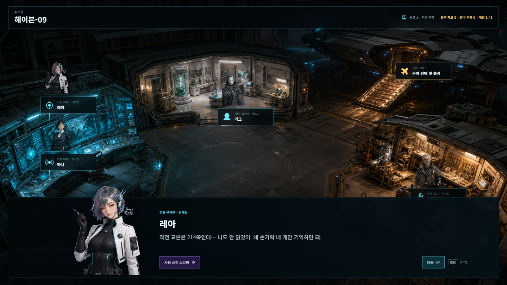
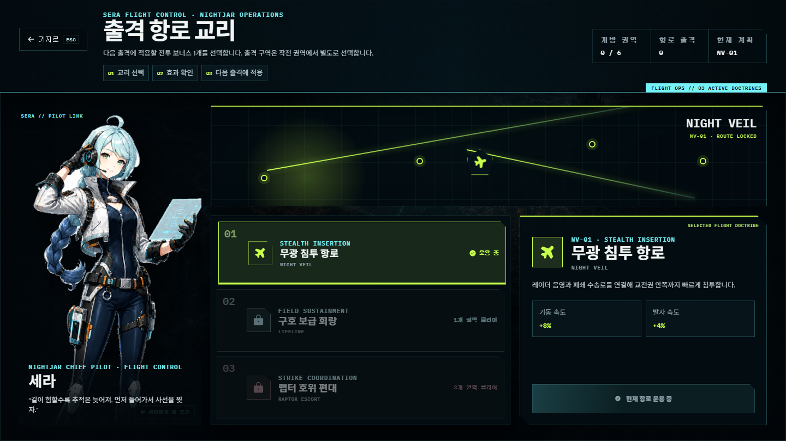
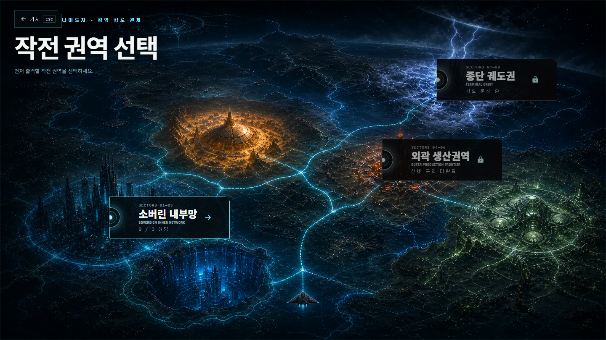
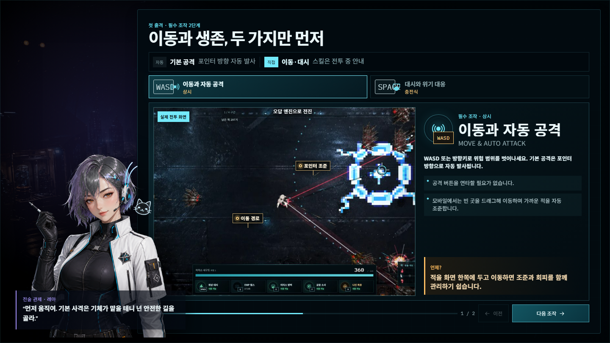
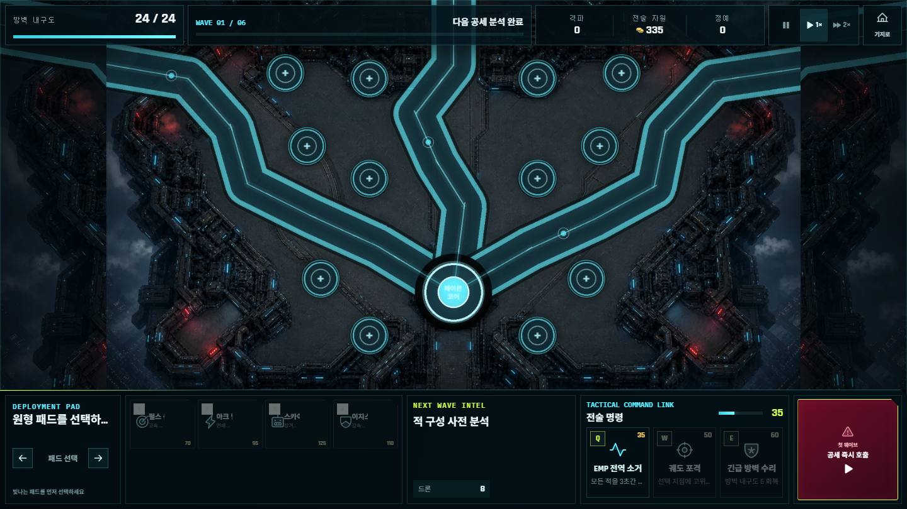

# HUMAN OVERRIDE: OVERLOAD

## AI 활용 + 게임 개발 프로젝트 포트폴리오

**기획 · 시스템 설계 · 구현 · 아트 파이프라인 · QA · 배포**

개인 프로젝트 · 2026년 8월 · OpenAI Codex Desktop 중심 협업 개발

> 통치 AI가 인간의 선택권을 장악한 세계에서, 이동 기지 HAVEN-09의 전투원들이 여섯 개 작전 구역과 독립 방어전을 수행하는 Phaser 기반 탑다운 액션 서바이버입니다.

**공개 플레이:** [human-override-overload.khyun97.chatgpt.site](https://human-override-overload.khyun97.chatgpt.site)

**소스 관리:** GitHub 저장소 기반 버전 관리

[PAGEBREAK]

## 1. 프로젝트 포트폴리오 요약


### 한눈에 보는 결과

| 항목 | 현재 결과 |
|---|---|
| 장르 | 탑다운 액션 서바이버 + 독립 타워 디펜스 |
| 플랫폼 | PC 웹, 세로 모바일 웹 · Capacitor 앱 이관 가능 구조 |
| 기술 | React, Phaser 4.2.1, TypeScript, Vite, 60Hz 결정론 엔진, Worker·D1·R2 Edge 서비스 |
| 캠페인 | 2개 권역, 6개 구역, 지역별 4,096×4,096 정사각형 전장, 6종 최종 보스 |
| 전투원 | AEGIS 기본, MIKA 01구역 해금, VESPER 03구역 해금 |
| 성장 | 전투 중 카드 빌드 + HANA 연구 + ILYA 장비 + 캐릭터별 Q→E→F→R 스킬 해금 |
| 보스 대응 | Shift 패링, 슬로 모션 번호 폭탄, 단계 변신, 지역별 독립 패턴 |
| 별도 모드 | 12개 거점·4종 시설·3개 스테이지 타워 디펜스 |
| 접근성 | 키보드·마우스, 터치 자동 조준, 플로팅 조이스틱, 전체 대화 Space 진행, 설정 메뉴 |
| AI 활용 | Codex 개발·QA·문서화, ImageGen 미술, Grok 영상, Suno BGM, Gemini 참고 비교, Google Cloud TTS |

이 프로젝트의 핵심 성과는 생성형 AI 결과물을 단순히 많이 넣은 것이 아닙니다. 사용자가 실제로 플레이하고 반복 검수한 결과를 **결정론 규칙, 저장 계약, UI 상태, 에셋 매니페스트, 회귀 테스트와 배포 게이트**로 바꾸었습니다. 품질이 낮은 잠입 프로토타입, 과밀 VFX, 브라우저 전체 TTS, Cubism 프록시는 삭제했고, 승인된 결과만 제품 경로에 남겼습니다.

### 담당 범위

- 게임 콘셉트·캠페인·캐릭터·보스·방어전 기획과 최종 의사 결정
- React/Phaser 구조, 결정론 시뮬레이션, 저장·해금·경제, PC/모바일 UI 구현
- 캐릭터·NPC·전장·적·보스·VFX 생성 브리프와 후처리 파이프라인
- 자동 테스트, TypeScript, production build, Sites 패키지, 브라우저 시각 QA
- Cloudflare Worker API, D1 리비전 저장, R2 에셋 캐시와 오프라인 우선 동기화 설계
- AI 사용·프롬프트·에셋 출처·권리 리스크·실패 이력 문서화

[PAGEBREAK]

## 2. 기획 의도

### 목표 경험

1. **교전하고 재배치한다.** 한 방향 스크롤에 갇히지 않고 정사각형 전장에서 360도로 움직이며 다음 공세의 유리한 위치를 선택합니다.
2. **빌드 선택이 화면과 전술을 바꾼다.** 자동 기본 공격 위에 직접 사용 스킬, 자동 기술, 아군, 무기별 성장과 캐릭터 고유 문법을 겹칩니다.
3. **경고를 읽고 숙련한다.** 보스 경고 그래픽과 실제 판정이 같은 geometry를 사용하고, 패링·번호 폭탄 실패 이유를 다음 시도에 학습할 수 있게 합니다.
4. **기지 활동이 다음 출격을 바꾼다.** 연구·장비·전투원 스킬·항로 교리를 서로 다른 성장 축으로 분리합니다.

### 플레이 루프

`HAVEN-09 준비 → 항로 교리 편성 → 권역·구역 선택 → 전투원 출격 → 웨이브·성장 → 중간 보스 → 최종 보스 → 결과·보상 → 귀환`

모든 원정은 헌터 8기로 시작합니다. 현재 웨이브가 전멸하면 플레이어 위치와 관계없이 경고 뒤 다음 공세가 시작됩니다. 적은 8방향 전송 게이트로 물질화하며, `14→22→34→52→79→120→180→220`기 공세와 지역별 총 예산을 결정론적으로 채웁니다. 우측 끝이나 특정 좌표까지 걸어야 다음 적이 나오는 공백을 제거했습니다.

### 캐릭터 해금과 정체성

| 전투원 | 해금 | 전투 정체성 | 메타 성장 |
|---|---|---|---|
| AEGIS | 기본 | 생존형 전술 요원, 펄스 소총·빔 소드 | Q 기본, E→F→R 순차 해금 |
| MIKA | 01구역 첫 클리어 | 링블레이드 연쇄·프리즘 보호막 | Q 기본, E→F→R 순차 해금 |
| VESPER | 03구역 첫 클리어 | 낮은 내구도·높은 기동과 정밀 요격 | Q 기본, E→F→R 순차 해금 |

잠긴 전투원도 정보 화면에서 원본 일러스트·역할·해금 조건을 볼 수 있습니다. 그러나 저장 데이터 위조나 직접 launch 주입이 있어도 출격·태그는 거부합니다. 해금된 전투원이 둘 이상이면 `T`로 교대하고 얼굴 중심 사이드 컷인을 짧게 표시합니다.



[PAGEBREAK]

## 3. 시스템 설계

### 권위 계층과 표시 계층 분리

```text
React UI / Phaser Scene
        ↓ 입력·이벤트 브리지
결정론 캠페인·디펜스 엔진 · 60Hz
        ↓ 상태 스냅샷
Phaser View / React HUD
```

- `src/swarm/engine.js`: 이동, 스폰, 피해, 웨이브, XP, 쿨타임, 보스 판정의 소스 오브 트루스
- `src/defense/engine.js`: 시설·적·웨이브·코어 내구도의 독립 방어전 규칙
- `src/phaser/`: 카메라, 스프라이트 풀, 입력 어댑터, VFX와 렌더 품질
- `src/ui/`: 저장 슬롯, 로비, NPC, 전투원, 지도, HUD, 대화, 가이드, 결과
- `src/game/content/`: 지역, 전투원, 무기, 연구, 장비, 해금과 표시 메타데이터
- `src/game/save/`: 3슬롯 저장, 구버전 마이그레이션, 잠금 상태 정규화, 오프라인 우선 클라우드 동기화

렌더 프레임이 느려져도 60Hz 시뮬레이션의 입력·충돌·피해·스폰은 바뀌지 않습니다. 경고선과 실제 피해 판정은 같은 geometry 객체를 사용하고, 미니맵·흔적·상호작용도 같은 4,096×4,096 월드 좌표 계약을 공유합니다.

### 비용 효율적인 서비스 경계

```text
브라우저 localStorage ──비동기 동기화── Worker API ── D1 revision save
                                           └────── R2 read-through asset cache
```

전투 상태를 서버 왕복에 묶지 않고 저장과 대용량 런타임 에셋만 Edge로 분리했습니다. 따라서 API나
네트워크 장애가 프레임·판정·플레이 가능 여부를 바꾸지 않습니다. D1 저장은 익명 bearer token의
SHA-256 해시, revision, checksum을 사용하고, 충돌 시 세 슬롯을 각각 최신 `updatedAt` 기준으로
병합합니다. R2는 Worker 전용 `/cdn/` namespace에서 Sites 정적 원본을 읽는 read-through 계층이며
영상·음원 Range 요청은 경로만 원본에 매핑해 직접 전달합니다. 운영·확장 판단은
`docs/service-architecture-ko.md`에 기록했습니다.

### 캐릭터별 스킬 해금

기존 캐릭터 강화의 피해·내구도·속도 증가는 HANA 연구와 ILYA 장비 기능을 중복했습니다. 이를 제거하고 각 전투원의 정체성이 직접 드러나는 스킬 사다리로 교체했습니다.

`Q 기본 제공 → E 해금 → F 해금 → R 해금`

- 전투원마다 독립 노드·아이콘·비용·선행 조건·설명 사용
- 잠긴 스킬은 HUD에서 상태와 조건을 표시하고 입력 이벤트·쿨타임을 소비하지 않음
- 태그 전환 시 캐릭터별 네 개 쿨타임 은행과 해금 상태를 독립 보존
- 향후 캐릭터별 추가 스킬을 넣을 수 있도록 슬롯 메타데이터와 제품 UI를 분리
- 구버전 AEGIS 3개 수치 강화는 구매 랭크 합을 최대 3등급 새 링크로 이관. 기존 각 라인의 2/5/9 누적 소비 합에서 새 링크 동일 등급의 1/2/3 누적 비용을 뺀 차액만 한 번 환급하며, `aegis-skill-link` 키가 이미 있으면 재이관·재환급하지 않는 idempotent 마이그레이션

### 보스 패턴 설계

- Shift 패링은 1.5초 창에서 16% 슬로 모션으로 명확한 반응 시간을 제공합니다.
- 번호 폭탄은 2/3/4개, 12/16/20초로 늘어나며 원본 컬러와 확대 조준점을 유지합니다.
- 제한 시간 초과 또는 순서 실패 시 슬로 모션이 즉시 풀리고 남은 폭탄이 플레이어에게 날아와 큰 피해를 줍니다.
- 보스 단계 변화, 패링 취약, 폭탄 실패는 별도 상태로 관리해 시각 효과가 판정을 대신하지 않습니다.

[PAGEBREAK]

## 4. UI/UX 설계와 개선

### 상용 게임 수준을 위한 원칙

- 게임 플레이 영역을 우선하고 HUD는 모서리·하단에 정렬합니다.
- 텍스트 크기를 실제 PC 1,440×900과 모바일 390×844에서 읽을 수 있는 최소치로 검수합니다.
- hover는 색·광택·내부 강조만 바꾸고 버튼 좌표를 이동시키지 않습니다.
- 비활성·잠금·완료·선택을 하나의 색으로 뭉개지 않고 상태별 의미를 분리합니다.
- PC UI를 단순 축소하지 않고 모바일 세로 전용 카메라·레이아웃·터치 표적을 사용합니다.

### 전투 HUD

- 상단 중앙에 축소된 웨이브 HUD를 고정합니다.
- 하단에는 내구도와 스킬 UI를 붙이고 입력 키를 아이콘 위에 크게 오버레이합니다.
- 우측 하단 미니맵은 safe area 안에 고정하고 테두리·내부 맵이 잘리거나 쿨타임 숫자와 겹치지 않게 합니다.
- 모바일은 화면의 비인터랙티브 지점에서 시작하는 플로팅 조이스틱과 최근접 위협 자동 조준을 사용합니다.

### NPC와 대화

- 대화창은 상반신 NPC와 확대 본문을 독립 영역에 두며 NPC 클릭 반응을 제거했습니다.
- 연구실·정비소·항로 관제 상세 화면만 좌측의 큰 하단 고정 일러스트 클릭 대사를 제공합니다.
- SERA는 허벅지 중간까지 보이게 하단에 고정하고, HANA·ILYA도 카드 안에 작은 전신을 가두지 않습니다.
- 모든 대화와 튜토리얼 설명은 `Space`로 한 줄씩 진행합니다.



### 로비·지도·출격

- 로비 캐릭터는 품질 검증을 통과한 정적 원본 일러스트를 사용합니다. 실패한 Live2D/Cubism 프록시는 제거했습니다.
- 재화 HUD와 설정 버튼은 충분한 간격을 유지하며, 설정에는 마스터/BGM/SFX·화면·성능·조작·접근성 항목이 있습니다.
- 권역과 구역 선택은 세계 지도 → 권역 → 개별 구역의 계층을 명확히 하고, 카드 레일·제목·완료·선택 상태가 잘리지 않게 합니다.
- 출격 준비는 적·보스·보상·전투원 선택과 최종 CTA에 집중하고, 장비 변경은 전투원 관리로 분리합니다.





[PAGEBREAK]

## 5. 디펜스 모드 고도화

캠페인의 부속 메뉴가 아니라 별도 게임 루프로 설계했습니다. `src/defense/engine.js`가 60Hz 규칙을 소유하고 Phaser가 PC 1,280×720과 모바일 720×1,280 전장을 각각 표시합니다.

| 구성 | 내용 |
|---|---|
| 스테이지 | 헤이븐 외곽선 6웨이브, 중계망 정전 8웨이브, 소버린 야간 공성 10웨이브 |
| 시설 | 펄스 센트리, 아크 릴레이, 스카이파이어 포대, 이지스 바스티온 |
| 배치 | 12개 패드, 시설별 비용·사거리·공격 역할, 최대 3랭크 |
| 조작 | 설치 후 뒤로 갈 필요 없이 팔레트에서 다음 타워 즉시 선택, 선택 시설 강화·판매 |
| 피드백 | 설치·강화·취소·웨이브·능력·돌파·수리·정예 격파·승리·패배별 절차 합성 SFX |
| 접근성 | 축소 하단 명령 패널, 큰 터치 표적, RHEA 스포트라이트 가이드 |



캠페인과 디펜스는 재화·저장·설정은 공유하지만 시뮬레이션 상태와 승패 판정은 공유하지 않습니다. 디펜스 SFX는 외부 음원 파일이 아니라 Web Audio 절차 합성이며 공통 SFX 음량 설정을 따릅니다.

### 독립 항로 관제

비행선 조종사 SERA는 기존의 작전 권역 출격 버튼을 복제하지 않습니다. 항로 관제는 **무장 침투, 구호 보급, 호위 편대** 같은 침투 교리를 선택해 다음 출격의 이동·생존·화력 조건을 바꾸는 메타 콘텐츠입니다. 실제 출격 구역 선택은 이후 세계 지도 흐름에서 처리합니다.

[PAGEBREAK]

## 6. AI 활용 워크플로

### 도구별 역할

| 도구 | 역할 | 제품 반영 기준 |
|---|---|---|
| OpenAI Codex Desktop | 기획 정리, 구현, 리팩터링, 테스트, QA, 문서, 배포 보조 | 코드·테스트·브라우저 증거로 검증 |
| OpenAI ImageGen | 캐릭터, NPC, 보스, 전장, UI·VFX 원화 | 원본 보존, 투명도·프레임·경계 검사, 매니페스트 등록 |
| Grok | 01—03구역 출격 영상 | 사용자 제공 최종 파일만 사용 |
| Suno AI | 타이틀·기지·01—03 BGM | 사용자 제공 최종 파일, 제출 전 권리 증빙 필요 |
| Google Gemini | 이미지·영상·음원 방향의 멀티모달 참고 | 제품 자산의 직접 출처로 주장하지 않음 |
| Google Cloud TTS | AEGIS 탑재 AI 짧은 한국어 안내 | 오프라인 정적 파일, 현재 F/R만 런타임 활성 |

### 사람과 AI의 책임 경계

AI는 대안·초안·코드·이미지 후보를 빠르게 만들었습니다. 프로젝트 소유자는 다음을 직접 결정했습니다.

- 어떤 기획을 채택·철회하고 어떤 결과를 제품에서 삭제할지
- 캐릭터 체형·프레이밍·NPC 이름·말투·해금 시점과 플레이 규칙
- 전투 수치, 판정, UI 상태, 접근성, 성능 목표와 배포 승인
- 에셋 출처 기록, 제3자 참고 이미지의 비복제 조건, 제출 전 권리 게이트

### 실패 결과를 폐기한 사례

1. 초기 잠입 프로토타입은 현재 액션 서바이버 방향과 달라 활성 소스에서 제거했습니다.
2. 고해상도 반복 스킬 VFX는 GPU 메모리와 가독성을 해쳐 단순 도트 VFX와 geometry 경고로 교체했습니다.
3. 전체 브라우저 TTS는 장치별 음질 편차 때문에 제거하고 F/R 전술 음성만 정적으로 유지했습니다.
4. Cubism 프록시는 얼굴 분할선·부자연스러운 변형을 해결하지 못해 의존성과 함께 제거했습니다.
5. VESPER v1의 녹색 배경은 투명 후처리한 `vesper-portrait-v2.png`로 교체하고 v1은 제작 이력으로만 보존했습니다.

[PAGEBREAK]

## 7. 검증과 한계

### 검증 체계

- Node 회귀 테스트: 시뮬레이션, 저장, 진행, 해금, 콘텐츠, HUD, 모바일, 디펜스
- `npm run typecheck`: TypeScript 경계와 Phaser/React 통합 검사
- `npm run build`: Vite production 번들과 정적 자산 경로 검사
- `npm run test:sites`: Sites Worker 정적 자산·SPA fallback 검사
- 브라우저 QA: 1,440×900 데스크톱, 390×844 모바일, 콘솔·페이지 오류와 시각 겹침 확인
- PDF QA: 생성 후 페이지 렌더, contact sheet와 잘림·빈 페이지·깨진 한글 검사

직전 통합 체크포인트에는 자동 테스트, TypeScript, production build, Sites 패키지와 데스크톱·모바일 브라우저 QA를 함께 수행했습니다. 최신 NPC 배치, 스킬 해금, 태그 컷인과 문서 변경은 **최종 배포 전 전체 회귀로 재검증**하며, 이 문서는 현재 작업본의 통과 수치나 공개 배포 완료를 미리 선언하지 않습니다.

### 성능 대응

- CINEMATIC / BALANCED / PERFORMANCE 렌더 프로필과 고정 60Hz 시뮬레이션 분리
- 타이틀에서 Phaser를 선로딩하지 않고 선택 지역만 지연 로드
- 출격 영상 동안 숨겨진 전투 인스턴스를 정지 상태로 준비
- 모바일 PERFORMANCE 전용 경량 텍스처와 동일 atlas 계약
- 적·투사체·VFX·체력바 풀, 공간 버킷과 렌더 임시 자료구조 재사용

### 현재 한계와 외부 제출 게이트

- 외부 5명 플레이테스트의 KPI 원자료는 아직 수집 전이며 기획 문서 수치는 가설입니다.
- 04—06구역은 지역별 전용 BGM을 재생하며, 전용 출격 MP4가 없어 지역 포스터 전환을 사용합니다. 방어전·영입 장면에도 전용곡이 있습니다.
- Suno BGM 10곡은 파일·브리프·해시를 기록했지만 제작 계정·플랜·상업적 공개 범위 증빙이 저장소에 없습니다. 제출 전 증빙하거나 교체해야 합니다.
- 저장은 브라우저 로컬 3슬롯을 즉시 쓰는 오프라인 우선 구조이며, 공개 웹에서는 익명 기기 토큰으로 Worker·D1 클라우드 복제본과 동기화합니다. 계정 로그인과 기기간 이전은 아직 제공하지 않습니다. Android/iOS 출시는 Capacitor 생명주기·네이티브 저장·서명·스토어 실기기 QA가 별도 필요합니다.
- 07—09구역은 미래 슬롯일 뿐 현재 콘텐츠로 구현됐다고 주장하지 않습니다.

[PAGEBREAK]

## 8. 포트폴리오 관점의 핵심 역량

### 1. 요구를 제품 계약으로 바꾸는 능력

“모바일에서 너무 확대된다”, “UI가 겹친다”, “다음 적을 만나려면 우측으로 가야 한다” 같은 체감 피드백을 카메라 줌, safe area, HUD 앵커, 웨이브 authority, 월드 좌표와 테스트 수용 기준으로 바꿨습니다.

### 2. 생성형 결과를 실행 가능한 파이프라인으로 만드는 능력

생성 이미지 한 장으로 끝내지 않고 투명도 제거, 가장자리 색 오염, atlas 행·열, 성능 파생본, 매니페스트 키, 로딩 수명, 잠금 UI, 출처 기록까지 연결했습니다. VESPER v1→v2 교체처럼 품질 문제가 생기면 원본을 보존하고 활성 경로만 안전하게 교체합니다.

### 3. 게임 규칙과 연출을 분리하는 능력

패링 슬로 모션, 번호 폭탄, 태그 컷인, 전송 게이트와 미니맵은 판정을 대신하는 장식이 아닙니다. 엔진 상태가 먼저 결정되고 UI·VFX는 해당 상태를 읽어 표시합니다. 따라서 저사양 품질이나 프레임 드롭이 게임 결과를 바꾸지 않습니다.

### 4. 실패를 기록하고 삭제하는 능력

완성도가 낮은 Live2D, 과밀한 VFX, 역할이 중복된 캐릭터 수치 강화, 위치 도달형 웨이브를 유지하지 않았습니다. 왜 실패했는지와 현재 대안을 문서·테스트·CREDITS에 남겨 다음 개발자가 과거 결정을 실수로 복원하지 않게 했습니다.

### 5. 끝까지 전달하는 능력

로컬 구현뿐 아니라 TypeScript, 전체 테스트, production build, 브라우저 QA, 프로젝트 PDF와 공개 Sites 배포까지 하나의 완료 조건으로 관리합니다. 공개 사이트 상태와 검증 수치는 항상 특정 체크포인트로 표기하고, 최신 변경 검증 전에는 과거 결과를 현재 통과 선언으로 과장하지 않습니다.

## 9. 관련 문서

- `game/README.md` — 상세 런타임·구조·성능
- `game/docs/project/game-guide-ko.md` — 플레이 가이드
- `game/docs/project/content-design-baseline-ko.md` — 목표 경험·encounter beats·KPI
- `game/docs/project/ai-usage-report-ko.md` — AI 활용 기술·실제 프롬프트·실패 사례
- `game/CREDITS.md` — 에셋·도구·후처리·라이선스 이력
- `game/docs/mobile-app-release-roadmap.md` — Android/iOS 이관 계획
- `game/design-qa.md` — 반복 개선과 검증 체크포인트

**본 문서는 현재 소스와 함께 갱신되는 포트폴리오 원문입니다. 생성 PDF 파일명은 `HUMAN_OVERRIDE_OVERLOAD_AI_Game_Development_Portfolio_KO.pdf`입니다.**
